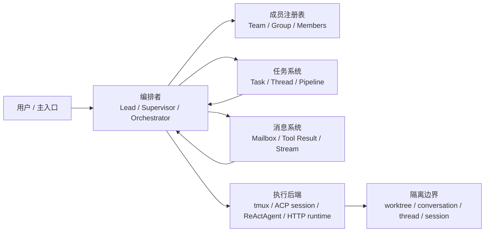

# Agent Team 实现总览

> 研究范围：`codes/ClawTeam`、`codes/AionUi`、`codes/claude-code-sourcemap`、`codes/lobehub`、`codes/agentscope-java`，并参考 `codes/learn-claude-code/s15_agent_teams` 与 `s16_team_protocols` 的讲解方式。

## 一句话结论

本仓库里真正实现了 agent team 或多 Agent 协作的项目可以分成五类：

| 项目 | team 形态 | 核心机制 | 适合学习的重点 | 文档 |
|---|---|---|---|---|
| ClawTeam | 外部 swarm runtime | 文件化 team / inbox / task，tmux 或子进程拉起 agent，git worktree 隔离 | 如何把 agent team 做成可观察、可恢复的 OS 级协作系统 | [clawteam.md](./clawteam.md) |
| AionUi | 应用内 team session | SQLite team repository，TeamSession 聚合 mailbox / task / teammate / MCP server | 如何把 team 做成桌面产品内的一等会话对象 | [aionui.md](./aionui.md) |
| Claude Code sourcemap | CLI 内建 swarm/team | `~/.claude/teams` 文件注册表、file mailbox、Task 工具、tmux/iTerm/in-process teammate | Claude Code 风格 agent team 的完整协议、权限冒泡和 idle loop | [claude-code-sourcemap.md](./claude-code-sourcemap.md) |
| LobeHub | Agent Group + isolated sub-agent thread | supervisor agent、virtual member agents、group topic、isolation thread、operation stream | Web 产品如何用“群组 + 子线程”表达 agent team | [lobehub.md](./lobehub.md) |
| AgentScope Java | 多 Agent 框架模式集合 | Pipeline、SubAgent Tool、Supervisor、Handoffs、Routing、MsgHub | 框架层如何抽象多 Agent 模式，而不是单一产品流程 | [agentscope-java.md](./agentscope-java.md) |

`learn-claude-code` 不是生产级产品实现，但它把 agent team 讲得很清楚：先讲为什么单 Agent 不够，再引入文件邮箱、队友线程、Lead inbox 注入，最后用 request-response 协议解释 shutdown 和 plan approval。本文档也沿用这个方式：先定义领域对象，再画完整协作流程，最后抽设计启示。

## 总体范式

无论名字叫 team、group、swarm、subagent 还是 pipeline，本质都在回答五个问题：

1. 谁是编排者：Lead、Supervisor、Orchestrator、Router，还是固定图节点。
2. 成员怎么登记：文件注册表、数据库 group、内存 agent list、Markdown spec。
3. 工作怎么分配：共享 task list、Task 工具、thread、pipeline edge、handoff tool。
4. 结果怎么回来：mailbox、tool result、SSE stream、thread summary、graph state。
5. 隔离在哪里：进程、终端 pane、conversation、thread、Agent session、worktree。

## 学习路径

如果目的是学习 agent team 的实现原理，建议按这个顺序读：

1. 先读 [claude-code-sourcemap.md](./claude-code-sourcemap.md)：它和 `learn-claude-code` 的教学章节最贴近，能看到 team config、mailbox、任务、权限、idle loop 如何拼成完整系统。
2. 再读 [clawteam.md](./clawteam.md)：它把同一类思路外置成独立 runtime，文件系统、tmux、worktree 的边界更清楚。
3. 然后读 [aionui.md](./aionui.md)：它展示桌面应用如何把 team 接到会话、路由、IPC、MCP server 和权限 UI。
4. 接着读 [lobehub.md](./lobehub.md)：它不是传统 inbox swarm，而是 Web 产品里的 group supervisor + isolated sub-agent thread。
5. 最后读 [agentscope-java.md](./agentscope-java.md)：它从框架角度总结多 Agent 模式，适合理解模式空间。

## 横向对比

| 维度 | ClawTeam | AionUi | Claude Code sourcemap | LobeHub | AgentScope Java |
|---|---|---|---|---|---|
| 编排中心 | CLI / MCP tools / leader | `TeamSession` + `TeamMcpServer` | Team lead session + tools | supervisor agent / group agent | Pipeline / Supervisor / Orchestrator |
| 成员模型 | `TeamMember` 文件配置 | `TeamAgent` + conversation | `TeamFile.members` | chat group members + virtual agents | Agent list / sub-agent registry |
| 消息通道 | file transport + mailbox | SQLite mailbox | file mailbox + poller | tool call result + thread / SSE | tool result / graph state / MsgHub |
| 任务模型 | JSON task store | SQLite team tasks | team task list | isolated thread task | Task tool / Pipeline node |
| 执行隔离 | tmux / subprocess + worktree | per-agent conversation | tmux / iTerm / in-process | isolation thread | agent session / graph node |
| 权限处理 | 依赖外部 agent / CLI 约束 | 应用权限与 backend 能力校验 | permission request 冒泡到 lead | headless 子任务为主 | Tool / HITL / session 机制 |
| 强项 | 可调试、可迁移、CLI 友好 | 产品化、状态一致、UI 顺滑 | 协议完整、适合学习 CC 风格 | Web 群组体验、线程记录清楚 | 模式完整、可组合 |

## 共同设计原则

- **先有 durable state，再唤醒 agent**：team config、mailbox、task/thread 必须先落地，否则 agent 崩溃后无法恢复上下文。
- **消息和任务要分开**：消息负责“告诉某人”，任务负责“系统当前该做什么”。两者混在一起会让恢复和可视化变困难。
- **编排者只拿摘要，成员保留细节**：这是 agent team 缓解上下文膨胀的核心价值。
- **隔离边界决定产品能力**：worktree 适合并行改代码；conversation/thread 适合 UI 产品；agent session 适合框架复用。
- **协议消息需要 request id**：shutdown、permission、plan approval 这类握手要有可关联的请求/响应状态。
- **idle 是正常状态，不是失败**：可靠 team runtime 要把“队友空闲等待输入”作为一等生命周期。

## 参考材料

- [learn-claude-code s15 Agent Teams](../../codes/learn-claude-code/s15_agent_teams/README.md)
- [learn-claude-code s16 Team Protocols](../../codes/learn-claude-code/s16_team_protocols/README.md)
- [旧版 ClawTeam + AionUi 合并分析](./clawteam-aionui.md)
