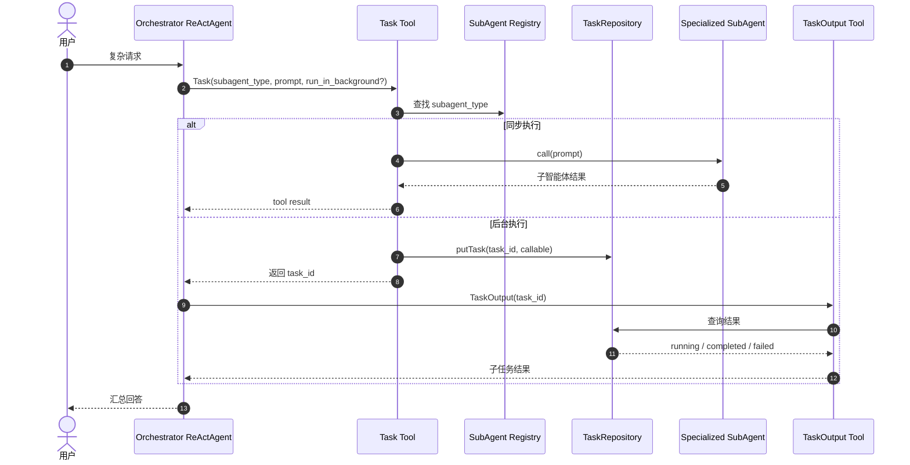
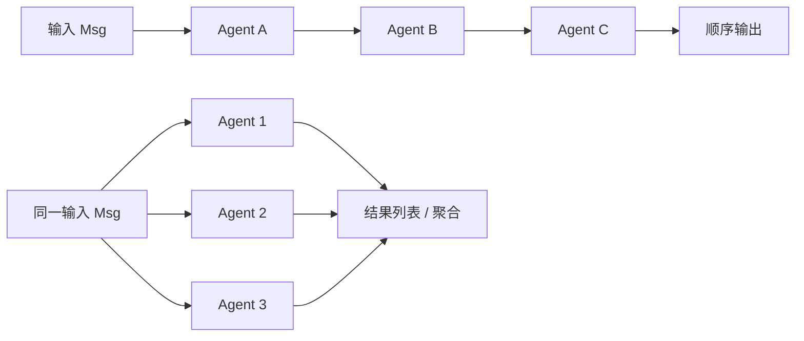
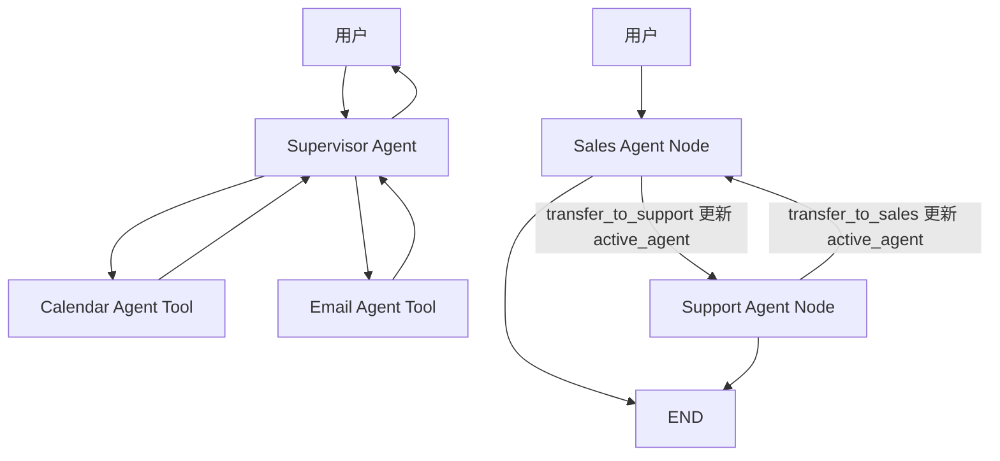

# AgentScope Java Multi-Agent 实现分析

> 研究对象：`codes/agentscope-java`
>
> 一句话结论：AgentScope Java 不是单一 agent team 产品，而是多 Agent 模式框架。它把团队协作拆成 Pipeline、SubAgent、Supervisor、Handoffs、Routing、Debate、Workflow 等可组合模式。

## 1. 领域对象

| 领域对象 | 作用 | 关键实现 |
|---|---|---|
| Agent / ReActAgent | 可调用的智能体实例，拥有模型、提示、工具、记忆 | `ReActAgent`、`AgentBase` |
| Pipeline | 多 Agent 固定流程执行接口 | `Pipeline`、`SequentialPipeline`、`FanoutPipeline` |
| SubAgentTool | 把一个 agent 包装成工具，支持 session_id 继续多轮 | `SubAgentTool` |
| Task Tool | 示例里的通用子智能体分发工具，按 `subagent_type` 调度 | `TaskTool`、`TaskToolsBuilder` |
| AgentSpec | Markdown 定义的子智能体规格 | `AgentSpecLoader`、`AgentSpecReActAgentFactory` |
| Supervisor | 主 agent 把专家 agent 当工具调用 | `multiagent-patterns/supervisor` |
| Handoff Tool | agent 通过工具更新 graph state，把控制权交给另一个 agent | `TransferToSalesTool`、`TransferToSupportTool` |
| StateGraph / Workflow | 用图结构显式编排节点、条件路由和状态 | `workflow`、`handoffs` examples |
| MsgHub / Debate | 多 agent 共享消息空间和主持人裁决 | `multiagent-debate` docs |

AgentScope Java 的文档把多 Agent 讲成模式集合：什么时候该用 pipeline，什么时候该用 supervisor，什么时候该用 subagent 或 handoff。这对学习实现原理很有帮助，因为它不把所有协作都塞进一种 team runtime。

## 2. 协作流程：SubAgent 模式

这个模式和 Claude Code 的 Task/subagent 很像，但更框架化：子智能体可以来自 Markdown spec，也可以是 Java 代码创建的 ReActAgent；后台任务由 repository 管理；主 agent 通过一个 Task tool 分发。

## 3. 协作流程：Pipeline / Fanout

`SequentialPipeline` 把上一个 agent 的输出作为下一个 agent 的输入；`FanoutPipeline` 把同一输入分发给多个 agent，可并发执行并收集结果。它们适合流程明确、无需 agent 自主聊天协调的场景。

## 4. 协作流程：Supervisor / Handoffs

Supervisor 模式中，专家 agent 被注册成工具，主 agent 决定调用谁并综合结果。Handoffs 模式中，agent 节点通过工具更新 `active_agent`，StateGraph 根据状态把控制权交给另一个节点。

## 5. 重要机制

### 框架提供模式，不固定产品流程

ClawTeam / AionUi / Claude Code 都有一个具体 team runtime；AgentScope Java 更像模式库：Pipeline、Routing、Subagents、Supervisor、Handoffs 可以单独使用，也可以组合。

### SubAgentTool 支持多轮 session

核心 `SubAgentTool` 参数包含 `session_id` 和 `message`。没有 session_id 就创建新 session；传入 session_id 就恢复子 agent 状态继续对话。这和示例 `TaskTool` 的“一次性子任务”不同，说明框架同时支持无状态和有状态子 agent。

### Markdown AgentSpec 降低扩展成本

示例里的 `agents/*.md` 用 front matter 定义 name、description、tools，正文是系统提示。这样新增子智能体不一定要改 Java 代码，只要加一个 spec 文件。

### 图状态支撑 Handoff

Handoffs 示例里，transfer tool 通过 `ToolContext` 更新 graph state。状态不是藏在 prompt 里，而是被 StateGraph 的条件边读取。这种方式适合“当前负责 agent 会变”的客服、销售、审批流。

## 6. 学习价值

AgentScope Java 适合学习多 Agent 模式选型：

- 固定流程：Pipeline；
- 多专家并发：Fanout；
- 一个主 agent 动态委托：Subagents / Supervisor；
- 当前负责人切换：Handoffs；
- 自定义确定性 + agent 混合：Workflow / StateGraph；
- 多视角讨论：Debate / MsgHub。

它提醒我们：agent team 不一定都要有邮箱和长期驻留成员。很多业务只需要“主 agent + 专家工具”或“图节点流转”，实现复杂度会低得多。

## 7. 参考代码

- [多智能体概览](../../codes/agentscope-java/docs/zh/multi-agent/overview.md)
- [Subagents 文档](../../codes/agentscope-java/docs/zh/multi-agent/subagent.md)
- [Pipeline 接口](../../codes/agentscope-java/agentscope-core/src/main/java/io/agentscope/core/pipeline/Pipeline.java)
- [SequentialPipeline](../../codes/agentscope-java/agentscope-core/src/main/java/io/agentscope/core/pipeline/SequentialPipeline.java)
- [FanoutPipeline](../../codes/agentscope-java/agentscope-core/src/main/java/io/agentscope/core/pipeline/FanoutPipeline.java)
- [SubAgentTool](../../codes/agentscope-java/agentscope-core/src/main/java/io/agentscope/core/tool/subagent/SubAgentTool.java)
- [Subagent example](../../codes/agentscope-java/agentscope-examples/multiagent-patterns/subagent)
- [Supervisor example](../../codes/agentscope-java/agentscope-examples/multiagent-patterns/supervisor)
- [Handoffs example](../../codes/agentscope-java/agentscope-examples/multiagent-patterns/handoffs)
