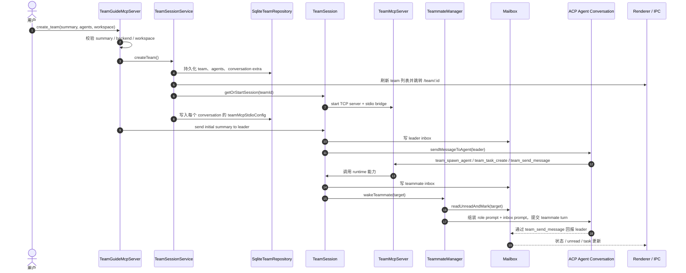

# AionUi Agent Team 实现分析

> 研究对象：`codes/AionUi`
>
> 一句话结论：AionUi 把 agent team 做成了桌面应用内的一等 runtime：team 是数据库对象，`TeamSession` 是运行时容器，`TeamMcpServer` 是控制面，teammate 通过 per-agent conversation 被唤醒。

## 1. 领域对象

| 领域对象 | 作用 | 关键实现 |
|---|---|---|
| Team | 应用内团队对象，持久化成员、workspace、状态 | `TeamSessionService`、`SqliteTeamRepository` |
| TeamAgent / Teammate | 团队成员，通常绑定一个 conversation | `types.ts`、`TeammateManager` |
| TeamSession | team 运行时容器，聚合 mailbox、task、teammate、MCP server | `TeamSession` |
| Mailbox | SQLite mailbox，负责跨成员异步消息和 read/unread | `Mailbox`、`SqliteTeamRepository` |
| TaskManager | 共享 team task 和依赖维护 | `TaskManager` |
| TeamGuideMcpServer | 创建 team 的入口，像“建队向导” | `mcp/guide/TeamGuideMcpServer.ts` |
| TeamMcpServer | team 内控制面，提供 send/spawn/task/list/shutdown tools | `mcp/team/TeamMcpServer.ts` |
| Conversation | 每个 agent 的实际运行会话，承载 ACP backend 和 UI 消息 | `conversation extra.teamId` |
| TeamEventBus / IPC | main process 与 renderer 的 team 状态同步通道 | `teamEventBus.ts` |

AionUi 的 team mode 不是外部脚本，而是嵌入产品的数据模型。它把“团队成员”映射到 conversation，把“团队控制面”映射到 MCP server，把“协作状态”放进 SQLite。

## 2. 协作流程

完整链路可以拆成三段：

1. **建队**：`TeamGuideMcpServer` 校验输入和 backend 能力，交给 `TeamSessionService.createTeam()` 持久化 team 和 conversation 关系。
2. **启动运行时**：`getOrStartSession()` 先启动 `TeamMcpServer`，再把 MCP stdio 配置写入所有 agent conversation，最后缓存 session。
3. **协作执行**：leader 或 teammate 通过 Team MCP tools 发消息、建任务、拉起成员；`TeammateManager` 读取 unread mailbox 并把消息转成 agent turn。

## 3. 重要机制

### TeamSession 是总装配点

`TeamSession` 同时持有 `Mailbox`、`TaskManager`、`TeammateManager` 和 `TeamMcpServer`。这让 AionUi 的 team runtime 有一个明确边界：持久化在 repository，运行时能力在 session，外部控制通过 MCP server 暴露。

### MCP 配置注入顺序很关键

`TeamSessionService.getOrStartSession()` 的顺序是先启动 Team MCP server，再把 per-agent `teamMcpStdioConfig` 注入 conversation，最后才把 session 放入缓存。这个顺序避免了“session 看似存在，但 agent 还没有 team tools”的半初始化状态。

### SQLite mailbox 的原子读

AionUi 的 mailbox 不是文件队列，而是 SQLite 表。`readUnreadAndMark()` 这类操作可以在事务里完成“读 unread 并标记已读”，这比文件 inbox 更适合桌面应用的数据一致性和 UI 查询。

### Teammate wake 是状态机

`TeammateManager` 不只是发消息。它要判断首次唤醒、后续唤醒、crash recovery、active wake 去重、wake timeout；还要决定是否注入完整 role prompt。它承担的是“把异步团队消息转换成一次可执行 agent turn”的职责。

## 4. 与 ClawTeam / Claude Code 的差别

| 维度 | AionUi | ClawTeam / Claude Code 风格 |
|---|---|---|
| 状态存储 | SQLite + conversation extra | 文件目录 + config / inbox / task |
| 执行隔离 | per-agent conversation | tmux / process / worktree |
| 控制面 | 应用内 Team MCP Server | CLI tool / file protocol / terminal pane |
| UI 关系 | 路由、IPC、会话列表天然联动 | UI 多为看板或终端视图 |
| 适合场景 | 桌面产品内的顺滑 team mode | CLI agent 并行执行和可移植 runtime |

## 5. 学习价值

AionUi 最值得学的是如何把 agent team 产品化：

- team 要进入应用数据模型，而不是只存在 prompt 里；
- 每个 teammate 需要独立 conversation，否则 UI、权限和历史都会混在一起；
- MCP server 是 team 内部能力的统一入口；
- 唤醒逻辑要和 mailbox、prompt、conversation 状态一起设计。

## 6. 参考代码

- [Team mode 产品说明](../../codes/AionUi/docs/readme/readme_ch.md)
- [team guide flow](../../codes/AionUi/docs/architecture/agent-team-guide-flow.md)
- [TeamSessionService](../../codes/AionUi/src/process/team/TeamSessionService.ts)
- [TeamSession](../../codes/AionUi/src/process/team/TeamSession.ts)
- [TeammateManager](../../codes/AionUi/src/process/team/TeammateManager.ts)
- [Mailbox](../../codes/AionUi/src/process/team/Mailbox.ts)
- [TaskManager](../../codes/AionUi/src/process/team/TaskManager.ts)
- [TeamMcpServer](../../codes/AionUi/src/process/team/mcp/team/TeamMcpServer.ts)
- [TeamGuideMcpServer](../../codes/AionUi/src/process/team/mcp/guide/TeamGuideMcpServer.ts)
- [SqliteTeamRepository](../../codes/AionUi/src/process/team/repository/SqliteTeamRepository.ts)
