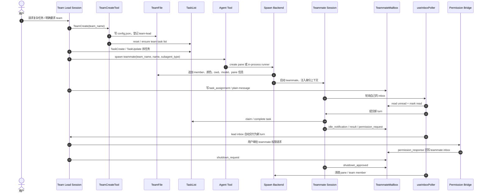
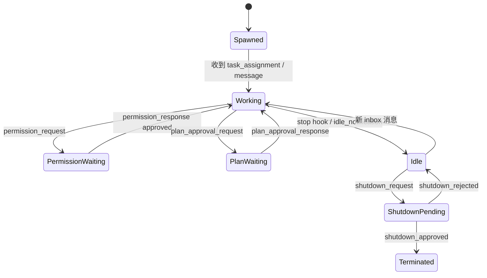

# Claude Code Sourcemap Agent Team 实现分析

> 研究对象：`codes/claude-code-sourcemap/restored-src/src`
>
> 一句话结论：Claude Code sourcemap 里的 swarm/team 是最接近 `learn-claude-code` 教学模型的生产级实现：team file、file mailbox、Task 工具、pane/in-process teammate、权限冒泡、idle notification、shutdown handshake 组成完整闭环。

## 1. 领域对象

| 领域对象 | 作用 | 关键实现 |
|---|---|---|
| TeamFile | `~/.claude/teams/{team}/config.json`，记录 lead、members、pane、cwd、model、权限模式 | `utils/swarm/teamHelpers.ts` |
| TeamCreateTool / TeamDeleteTool | 创建 / 清理 team 和对应 task list | `tools/TeamCreateTool`、`tools/TeamDeleteTool` |
| Teammate | swarm 成员，可是 tmux/iTerm pane，也可是 in-process runner | `utils/teammate.ts`、`utils/teammateContext.ts` |
| TeammateMailbox | 文件收件箱，按 agent name 写入 JSON 数组，带 read 标记和 lock | `utils/teammateMailbox.ts` |
| InboxPoller | 每秒轮询 inbox，把消息提交成新的 turn 或路由协议消息 | `hooks/useInboxPoller.ts` |
| Spawn backend | 创建 teammate 执行环境 | `PaneBackendExecutor`、`TmuxBackend`、`ITermBackend`、`InProcessBackend` |
| Task list | team 对应 task list，供 lead 和 teammate 共享 | `utils/tasks.ts`、`components/tasks/*` |
| Permission bridge | teammate 请求权限，lead 审批后回写响应 | `permissionSync.ts`、`leaderPermissionBridge.ts` |
| Team memory | 团队共享记忆同步 | `services/teamMemorySync/*` |

它的设计和 `learn-claude-code/s15`、`s16` 的教学逻辑高度一致，只是生产实现更完整：文件锁、UI 状态、权限、shutdown、plan approval、任务列表和不同执行后端都接进去了。

## 2. 协作流程

这套流程的关键不是“多开几个 Claude”，而是让每个 teammate 都成为一个有身份、有 inbox、有任务列表、有生命周期协议的参与者。

## 3. 消息与协议

Claude Code sourcemap 的 mailbox 是文件系统实现，但消息类型已经是协议化的。普通消息会进入模型上下文；结构化消息会被 poller 识别并路由。

重要协议包括：

- 普通 teammate message：用于协作沟通。
- `task_assignment`：Lead 给 teammate 分配任务。
- `idle_notification`：teammate 一轮结束后通知 Lead 自己空闲。
- `permission_request` / `permission_response`：teammate 的敏感工具调用冒泡到 Lead。
- `plan_approval_request` / `plan_approval_response`：plan-mode teammate 请求计划审批。
- `shutdown_request` / `shutdown_approved` / `shutdown_rejected`：体面关机握手。
- `team_permission_update` / `mode_set_request`：Lead 下发权限或模式变更。

## 4. 重要机制

### Team = TaskList

`TeamCreateTool` 创建 team file 的同时会 reset 并确保同名 task list。这样 Lead 和 teammate 都围绕同一组任务协作，任务 owner 可以直接使用 teammate 的 name。

### lead 不是 teammate

创建 team 时不会给 lead 设置 `CLAUDE_CODE_AGENT_ID`。这是刻意设计：lead 是编排者，不应该被 `isTeammate()` 判断为 teammate，否则 inbox poller 和权限路径会混乱。

### pane teammate 与 in-process teammate 共用协议

tmux/iTerm teammate 通过 CLI 参数和环境变量拿身份；in-process teammate 通过 AsyncLocalStorage 拿隔离上下文。两者都使用同一套 team file、mailbox 和消息协议。这是它能同时支持终端 swarm 和内嵌执行的关键。

### 权限冒泡

teammate 遇到需要用户审批的工具调用时，不直接弹自己的 UI，而是写 `permission_request` 到 lead inbox。Lead 的 poller 把请求接到确认队列；用户审批后，Lead 再写 `permission_response` 回 teammate inbox。这让权限仍由主会话掌控。

### 自动 inbox 交付

TeamCreate 的 prompt 明确告诉模型：消息会自动交付，不需要手动 check inbox。这对应代码里的 `useInboxPoller`：Lead 和 teammate 都轮询 inbox，消息可以被提交为新的 turn。

## 5. 和 learn-claude-code 的对应关系

| learn-claude-code 教学点 | Claude Code sourcemap 生产实现 |
|---|---|
| `MessageBus` 文件邮箱 | `teammateMailbox.ts` + lockfile |
| `spawn_teammate_thread` | Agent tool + pane backend / in-process backend |
| Lead inbox 注入 history | `useInboxPoller` 自动提交 teammate message |
| shutdown request-response | `shutdown_request` / approved / rejected |
| plan approval request-response | plan approval messages + permission mode |
| idle loop | stop hooks + `idle_notification` + poller |
| 简化任务系统 | team task list + owner/status/dependency |

## 6. 学习价值

这是学习 agent team 最完整的一条线：

- team 是 durable file registry；
- teammate 是有身份的独立执行体；
- mailbox 是异步通信层；
- task list 是共享工作协调层；
- poller 把外部消息转成 agent turn；
- request-response 协议支撑权限、审批和关机；
- UI 只是在这些状态之上呈现。

## 7. 参考代码

- [TeamCreateTool](../../codes/claude-code-sourcemap/restored-src/src/tools/TeamCreateTool/TeamCreateTool.ts)
- [TeamCreate prompt](../../codes/claude-code-sourcemap/restored-src/src/tools/TeamCreateTool/prompt.ts)
- [Team helpers](../../codes/claude-code-sourcemap/restored-src/src/utils/swarm/teamHelpers.ts)
- [Teammate mailbox](../../codes/claude-code-sourcemap/restored-src/src/utils/teammateMailbox.ts)
- [Inbox poller](../../codes/claude-code-sourcemap/restored-src/src/hooks/useInboxPoller.ts)
- [Pane backend executor](../../codes/claude-code-sourcemap/restored-src/src/utils/swarm/backends/PaneBackendExecutor.ts)
- [Tmux backend](../../codes/claude-code-sourcemap/restored-src/src/utils/swarm/backends/TmuxBackend.ts)
- [In-process teammate task](../../codes/claude-code-sourcemap/restored-src/src/tasks/InProcessTeammateTask/InProcessTeammateTask.tsx)
- [Permission sync](../../codes/claude-code-sourcemap/restored-src/src/utils/swarm/permissionSync.ts)
- [learn-claude-code s15](../../codes/learn-claude-code/s15_agent_teams/README.md)
- [learn-claude-code s16](../../codes/learn-claude-code/s16_team_protocols/README.md)
