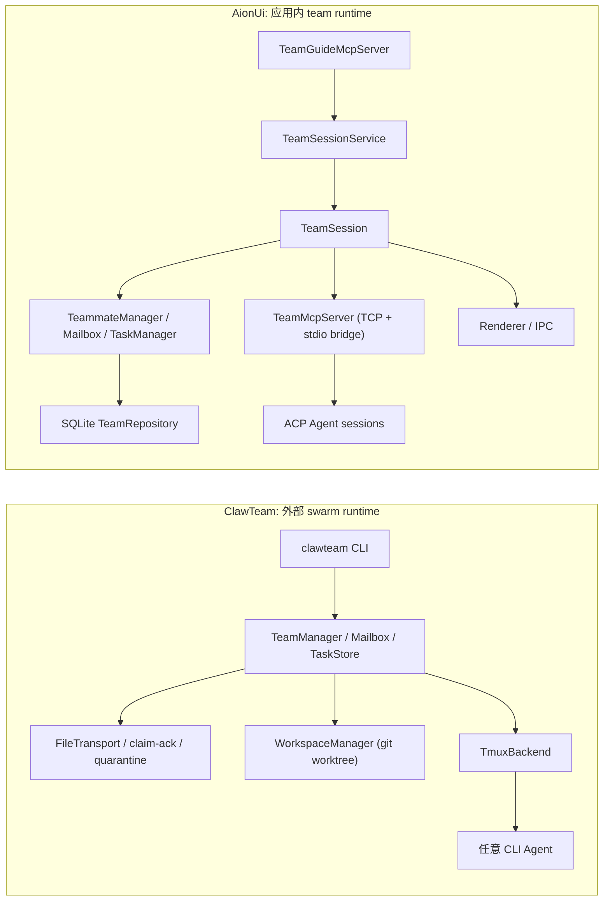

# ClawTeam 与 AionUi 的 Agent Team 实现深度分析

> 研究范围：`codes/ClawTeam` 与 `codes/AionUi`
> 
> 一句话结论：ClawTeam 把 team 做成了“外部 swarm 运行时”，AionUi 把 team 做成了“应用内一等对象”。

## 执行摘要

ClawTeam 和 AionUi 都在做多 Agent 协作，但切入点完全不同。

- ClawTeam 更像一个独立的编排层：team 状态落在文件系统里，agent 以独立 CLI 进程和 tmux 窗口运行，消息、任务、工作区隔离都由 CLI 和本地文件协作完成。
- AionUi 更像一个应用内 team runtime：team 是数据库里的对象，`TeamSession` 统一持有 mailbox、task、teammate 和 MCP server，UI、路由、对话和 team 状态被串成一条链。

它们共同的原则是“先有持久状态，再唤醒 agent”，但 ClawTeam 偏 OS / 工具链，AionUi 偏产品 / 会话系统。

## 总体结构

| 维度 | ClawTeam | AionUi |
|---|---|---|
| team 边界 | 文件系统上的 team 目录、inbox、task、worktree | SQLite 中的 team / mailbox / task，再加 conversation extra |
| 调度入口 | `clawteam` CLI | `TeamGuideMcpServer` + `TeamMcpServer` + UI 事件流 |
| 执行单元 | 独立 CLI agent 进程 | 绑定 conversation 的 agent session |
| 隔离方式 | Git worktree + tmux 窗口 | 共享 workspace + 独立 conversation / 权限弹窗 |
| 消息模型 | 文件消息 + event log | SQLite mailbox + read/unread 原子更新 |
| 任务模型 | JSON 文件 + 文件锁 | SQLite task 表 + 事务 |

## ClawTeam：把 team 做成可操作的 OS 资源

ClawTeam 的核心不是“有个团队概念”，而是把团队拆成几个可以直接落盘、直接看见、直接恢复的对象。

`TeamManager.create_team()` 会写 `config.json`，创建 leader inbox 和 tasks 目录；`TeamMember`、`TeamConfig`、`TeamMessage`、`TaskItem` 是它的核心数据模型。`resolve_inbox()` 负责把逻辑名称映射成磁盘 inbox 名称，确保 sender / recipient 都能被稳定定位。

消息层是 `MailboxManager` + Transport。默认 `FileTransport` 把每条消息写成 `msg-*.json`，用 tmp+rename 保证原子性；`claim_messages()` 会把消息转成 `.consumed` 并加锁，`ack()` / `quarantine()` 则把成功消费和坏消息隔离开。它还有 `event log`，所以“收件箱”和“历史审计”是分开的。

任务层是 `FileTaskStore`。每个 task 是独立 JSON 文件，写入受 OS advisory lock 保护；`blockedBy` / `blocks` 形成双向依赖图，任务完成时会自动解除下游阻塞。这个设计很朴素，但非常适合 CLI 环境和脚本化调试。

执行隔离是 ClawTeam 的亮点之一。`WorkspaceManager` 会为每个 agent 创建 `clawteam/{team}/{agent}` 分支和 worktree；`TmuxBackend` 则给每个 agent 一个 tmux window，并注入 `CLAWTEAM_AGENT_ID`、`CLAWTEAM_AGENT_NAME`、`CLAWTEAM_TEAM_NAME` 等身份变量。换句话说，ClawTeam 把“团队成员”直接映射成了操作系统层面的独立工作单元。

它的 CLI 层也很直接：`team spawn-team`、`spawn`、`task create/update/list`、`inbox send/receive`、`board attach`。FastMCP server 只是把这些能力包装成 MCP tools，本质上还是在暴露同一套编排能力。

这套设计的结果是：ClawTeam 很适合“多个 CLI agent 并行干活”的场景，尤其是你需要 git context、tmux 可视化和跨 agent 消息时。但它对 agent 自身的 CLI 可运行性要求很高，自治更多靠明确的工作流和轮询协议，而不是 app 内部魔法。

## AionUi：把 team 做成应用内一等对象

AionUi 的 team mode 是产品内建能力，不是外部插件式协作层。README 里把它定义成：Leader 收到指令后拆分子任务，通过 Team MCP Server 委派给 Teammate，并通过异步邮箱和共享任务看板协作。

真正的入口是 `TeamGuideMcpServer.handleCreateTeam()`。它会先校验 `summary`，必要时从当前 conversation 继承 workspace，再根据 `AION_MCP_BACKEND` 和 `isTeamCapableBackend()` 选择 leader backend，然后调用 `TeamSessionService.createTeam()` 创建 team。创建完成后，它会发 IPC 刷新团队列表、跳转到 `/team/:id`，并异步启动 session，把 summary 发给 leader。

`TeamSessionService` 是 AionUi team runtime 的总装配机。`createTeam()` 会为每个 agent 创建或复用 conversation，把 `teamId` 写进 conversation extra，再把 team 持久化到数据库；`getOrStartSession()` 会先启动 `TeamMcpServer`，再把 per-agent 的 `teamMcpStdioConfig` 注入到所有 conversation，最后才把 session 放进缓存。这个顺序很关键，它避免了“session 已缓存但 MCP 配置没写完”的半残状态。

`TeamSession` 则是运行时容器，直接拥有 `Mailbox`、`TaskManager`、`TeammateManager` 和 `TeamMcpServer`。用户消息会先写进 leader inbox，再同步进 leader conversation，让 UI 里看起来还是一条正常对话；`sendMessageToAgent()` 则支持 silent 模式，适合复用 leader conversation 的场景。

真正的 agent 唤醒逻辑在 `TeammateManager`。它会先读 unread mailbox，再把消息包装成 prompt，必要时注入完整 role prompt；首次唤醒和 crash recovery 走 full prompt，后续唤醒只发消息内容。它还维护 `activeWakes` 和 `WAKE_TIMEOUT_MS`，避免重复唤醒和悬挂 turn。这个类本质上就是一个状态机加 prompt 组装器。

`TeamMcpServer` 是 AionUi 的对外控制面。它在 Electron main process 里跑 TCP server，再通过 stdio script 桥接 ACP session。工具集包括 `team_send_message`、`team_spawn_agent`、`team_task_create/update/list`、`team_members`、`team_shutdown_agent` 等。`team_spawn_agent` 会校验后端能力，`team_send_message` 会在广播/单播后唤醒目标，`team_task_update` 在完成后自动解除依赖。

持久化层是 `SqliteTeamRepository`。teams、mailbox、team_tasks 都存进 SQLite；`readUnreadAndMark()` 用事务把“读并标记已读”做成原子操作，`appendToBlocks()` / `removeFromBlockedBy()` 则把任务依赖图维护在数据库里。AionUi 的 team 不是散落在文件里的脚本状态，而是 app 数据模型的一部分。

这套设计的结果是：AionUi 的 team mode 很适合 UI 驱动、权限敏感、需要路由联动的产品场景。它对用户来说更顺滑，但也更依赖 AionUi 自己的 conversation / backend 抽象，天然没有 ClawTeam 那么“通吃 CLI”的开放边界。

## 真正的差别

| 主题 | ClawTeam | AionUi |
|---|---|---|
| team 是什么 | 一组可由 CLI 操作的 OS 资源 | 一个由应用持久化和渲染的会话对象 |
| 谁在调度 | 人和 leader agent 通过 CLI 指令调度 | 应用内 MCP + IPC + session service 调度 |
| agent 怎么跑 | tmux / subprocess / 任意 CLI agent | 绑定 conversation 的 ACP / Gemini / Aionrs 等 session |
| 消息怎么走 | 文件 inbox / event log / transport | SQLite mailbox + conversation bubble + wake |
| 任务怎么管 | 独立 JSON task 文件 | SQLite task 表和依赖图 |
| 空间怎么隔离 | git worktree per agent | 共享 workspace，但每个 agent 有独立 conversation 和权限确认 |
| 失败怎么恢复 | worktree、消息、任务都能从磁盘重建 | session 要在 MCP 配置注入完成后才算可用 |

## 设计启示

- 如果你的目标是“任何能跑命令行的 agent 都能加入”，ClawTeam 这种外部编排器更合适。
- 如果你的目标是“在一个桌面产品里把 team mode 做成自然的用户体验”，AionUi 这种应用内 runtime 更合适。
- 两者都证明了一件事：agent team 的关键不是“多开几个 agent”，而是控制面、持久化、消息和隔离这四层是否彼此对齐。
- 真正可靠的 team 系统，必须先定义好 durable state，再定义 wake / prompt / UI 怎么围着它转。

## 参考

- [ClawTeam 群体智能说明](</Users/huangkl/Workspace/codes/agent-design-analysis/codes/ClawTeam/README_CN.md:142>)
- [ClawTeam 运行时与 CLI 约定](</Users/huangkl/Workspace/codes/agent-design-analysis/codes/ClawTeam/docs/skills/clawteam/SKILL.md:21>)
- [ClawTeam 工作流示例](</Users/huangkl/Workspace/codes/agent-design-analysis/codes/ClawTeam/docs/skills/clawteam/references/workflows.md:1>)
- [ClawTeam TeamManager](</Users/huangkl/Workspace/codes/agent-design-analysis/codes/ClawTeam/clawteam/team/manager.py:78>)
- [ClawTeam MailboxManager](</Users/huangkl/Workspace/codes/agent-design-analysis/codes/ClawTeam/clawteam/team/mailbox.py:32>)
- [ClawTeam FileTransport](</Users/huangkl/Workspace/codes/agent-design-analysis/codes/ClawTeam/clawteam/transport/file.py:102>)
- [ClawTeam FileTaskStore](</Users/huangkl/Workspace/codes/agent-design-analysis/codes/ClawTeam/clawteam/store/file.py:45>)
- [ClawTeam WorkspaceManager](</Users/huangkl/Workspace/codes/agent-design-analysis/codes/ClawTeam/clawteam/workspace/manager.py:53>)
- [ClawTeam TmuxBackend](</Users/huangkl/Workspace/codes/agent-design-analysis/codes/ClawTeam/clawteam/spawn/tmux_backend.py:35>)
- [ClawTeam MCP server](</Users/huangkl/Workspace/codes/agent-design-analysis/codes/ClawTeam/clawteam/mcp/server.py:13>)
- [AionUi Team Mode 产品定义](</Users/huangkl/Workspace/codes/agent-design-analysis/codes/AionUi/docs/readme/readme_ch.md:158>)
- [AionUi team guide flow](</Users/huangkl/Workspace/codes/agent-design-analysis/codes/AionUi/docs/architecture/agent-team-guide-flow.md:1>)
- [AionUi TeamGuideMcpServer](</Users/huangkl/Workspace/codes/agent-design-analysis/codes/AionUi/src/process/team/mcp/guide/TeamGuideMcpServer.ts:34>)
- [AionUi TeamSessionService](</Users/huangkl/Workspace/codes/agent-design-analysis/codes/AionUi/src/process/team/TeamSessionService.ts:475>)
- [AionUi TeamSession](</Users/huangkl/Workspace/codes/agent-design-analysis/codes/AionUi/src/process/team/TeamSession.ts:21>)
- [AionUi TeammateManager](</Users/huangkl/Workspace/codes/agent-design-analysis/codes/AionUi/src/process/team/TeammateManager.ts:27>)
- [AionUi TeamMcpServer](</Users/huangkl/Workspace/codes/agent-design-analysis/codes/AionUi/src/process/team/mcp/team/TeamMcpServer.ts:55>)
- [AionUi SqliteTeamRepository](</Users/huangkl/Workspace/codes/agent-design-analysis/codes/AionUi/src/process/team/repository/SqliteTeamRepository.ts:105>)
