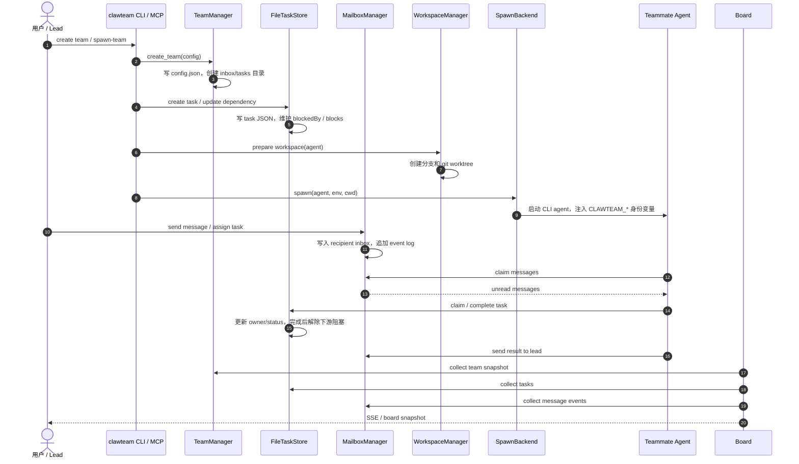
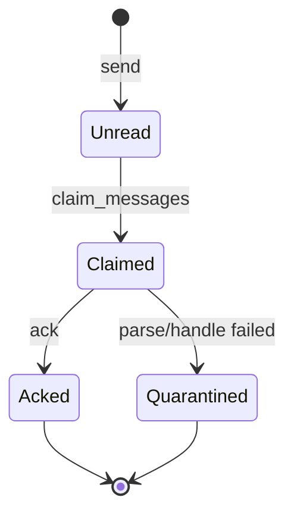

# ClawTeam Agent Team 实现分析

> 研究对象：`codes/ClawTeam`
>
> 一句话结论：ClawTeam 把 agent team 做成了“外部 swarm runtime”：团队状态在文件系统里，agent 以 tmux / subprocess / wsh 等后端运行，消息、任务、工作区和看板都能脱离单个应用独立存在。

## 1. 领域对象

| 领域对象 | 作用 | 关键实现 |
|---|---|---|
| Team | 团队边界，包含成员、配置、inbox、tasks、workspace | `TeamManager`、`TeamConfig` |
| TeamMember | 成员身份，包含 id、name、role、client、cwd 等 | `TeamMember` |
| TeamMessage | 跨 agent 消息，包含 sender、recipient、type、content、timestamp | `TeamMessage` |
| Mailbox | 每个成员的收件箱，支持 claim、ack、quarantine | `MailboxManager`、`FileTransport` |
| TaskItem | 共享任务，带 status、owner、blockedBy、blocks | `FileTaskStore`、`TaskStore` |
| Workspace | 每个 agent 的代码工作区，通常是 git worktree | `WorkspaceManager` |
| SpawnBackend | 启动 agent 的执行后端 | `TmuxBackend`、`SubprocessBackend`、`WshBackend` |
| BoardSnapshot | 团队看板快照，给 Web UI / SSE 使用 | `BoardCollector`、`board/server.py` |
| MCP Tools | 把 team / inbox / task / workspace 能力暴露给模型 | `clawteam/mcp/tools/*` |

ClawTeam 的核心抽象不是“一个聊天群”，而是一组可被 CLI、MCP 和 Web board 同时观察的本地资源：team 配置文件、成员 inbox、task JSON、event log、worktree、agent session。

## 2. 协作流程

完整链路可以理解为：

1. CLI 或 MCP tool 创建 team，`TeamManager` 落盘团队配置和目录结构。
2. Lead 创建任务，`FileTaskStore` 用独立 JSON 文件记录任务状态和依赖关系。
3. 启动 teammate 前，`WorkspaceManager` 为成员创建独立 worktree。
4. `SpawnBackend` 以 tmux pane、subprocess 或 wsh session 运行 agent，并通过环境变量注入身份。
5. agent 通过 mailbox 收消息，通过 task store 认领和完成任务，通过 event log 留痕。
6. Web board 不参与决策，只周期性收集 team、task、message、workspace 状态并推快照。

## 3. 重要机制

### 文件化 durable state

ClawTeam 用文件系统当协作数据库。好处是透明、可调试、进程崩溃后仍可恢复；代价是并发控制要显式处理。它通过 tmp + rename、文件锁、claim/ack/quarantine 等机制减少消息丢失和坏消息阻塞。

### 消息消费协议

消息不是简单 read-and-delete，而是经过 claim → ack 的阶段：

这比教学版 `learn-claude-code` 的 `.jsonl` 邮箱更接近生产系统：读消息和消费消息分离，坏消息可隔离，历史事件仍可审计。

### 任务依赖图

Task 的 `blockedBy` / `blocks` 是 ClawTeam 协作的第二条主线。成员不是只靠聊天协调，而是共享任务看板：谁认领、谁完成、谁被阻塞都落盘。完成一个任务后，下游任务可以被自动解锁。

### OS 级执行隔离

ClawTeam 把 teammate 映射成真实运行单元：一个 tmux window/pane、一个 cwd、一个 worktree、一组身份环境变量。这让它适合“多个 coding agent 并行改代码”的场景，也让调试方式很直接：看 tmux、看文件、看 git。

## 4. 学习价值

ClawTeam 最值得学的是外部 runtime 的边界设计：

- team runtime 不绑定某个 UI 或某个模型 provider；
- agent 可以是任意 CLI，只要遵守身份、mailbox、task 约定；
- 持久化状态和运行进程解耦，进程可以重启，状态还在；
- 看板是派生视图，不是事实来源。

## 5. 参考代码

- [README_CN.md](../../codes/ClawTeam/README_CN.md)
- [TeamManager](../../codes/ClawTeam/clawteam/team/manager.py)
- [Team models](../../codes/ClawTeam/clawteam/team/models.py)
- [MailboxManager](../../codes/ClawTeam/clawteam/team/mailbox.py)
- [FileTransport](../../codes/ClawTeam/clawteam/transport/file.py)
- [FileTaskStore](../../codes/ClawTeam/clawteam/store/file.py)
- [WorkspaceManager](../../codes/ClawTeam/clawteam/workspace/manager.py)
- [TmuxBackend](../../codes/ClawTeam/clawteam/spawn/tmux_backend.py)
- [Board server](../../codes/ClawTeam/clawteam/board/server.py)
- [MCP tools](../../codes/ClawTeam/clawteam/mcp/tools)
