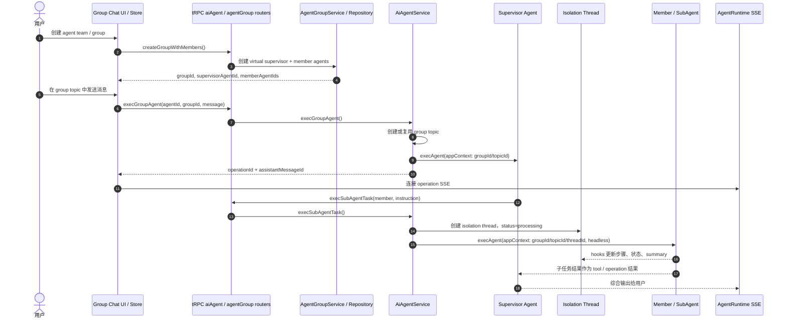

# LobeHub Agent Team 实现分析

> 研究对象：`codes/lobehub`
>
> 一句话结论：LobeHub 的 agent team 更像 Web 产品里的“Agent Group + Supervisor + isolated sub-agent threads”，不是文件 inbox swarm。它用数据库 group 表达团队，用 supervisor agent 表达编排者，用 isolation thread 表达子任务隔离。

## 1. 领域对象

| 领域对象 | 作用 | 关键实现 |
|---|---|---|
| ChatGroup / AgentGroup | 团队容器，包含 supervisor 和成员 agent | `AgentGroupRepository`、`ChatGroupModel` |
| Supervisor Agent | group 的主入口 agent，负责和用户对话、委托成员 | `createGroupWithSupervisor` |
| Member Agent | group 成员，可是真实 agent，也可以是 virtual agent | `batchCreateAgentsInGroup` |
| Group Topic | group 对话主题，绑定 `groupId` | `execGroupAgent` |
| Agent Runtime Operation | 一次 agent 执行，提供 operationId、SSE stream、取消和状态查询 | `AgentRuntimeService`、store operation slice |
| SubAgent Task | supervisor 或 agent 委托出去的隔离任务 | `execSubAgentTask` |
| Isolation Thread | 子任务独立线程，记录执行过程和最终 summary | `ThreadType.Isolation` |
| Thread Hooks | 把子任务步骤、完成、错误同步到 thread metadata / task message | `createThreadHooks` |

LobeHub 的重点是产品表达：用户看到的是 group、成员、topic、thread 和 streaming message；底层编排通过 tRPC mutation、agent runtime operation 和 SSE stream 串起来。

## 2. 协作流程

完整流程分两层：

1. **Group 对话层**：用户和 supervisor agent 在 group topic 中对话，前端用 optimistic message + operation + SSE stream 呈现执行过程。
2. **SubAgent 任务层**：supervisor 通过后端 mutation 创建 isolation thread，再让成员 agent 在 thread 上下文里 headless 执行，结果回到 supervisor 和 UI。

## 3. 重要机制

### Group 是产品对象，不是运行时目录

LobeHub 的 `AgentGroupService` 主要负责 group CRUD、成员详情、默认配置合并、virtual agent 生命周期。它不像 ClawTeam 那样创建 inbox/task 目录，而是用数据库模型表达团队。

### Supervisor 和成员都是 agent

创建 group 时可以自动创建 virtual supervisor agent，也可以批量创建 virtual member agents。Supervisor 并不是硬编码调度器，而是一个有系统提示和工具能力的 agent。

### 子任务用 Thread 隔离

`execSubAgentTask()` 会为每个子任务创建 `ThreadType.Isolation` thread，并把 `groupId`、`topicId`、`threadId` 放进 appContext。这样成员 agent 的中间过程不会污染 group 主对话，但 UI 仍能追踪 thread 状态。

### Operation 串起后端和 UI

前端发送 group message 时先创建 parent operation 和临时消息，再调用 `execGroupAgent`。后端返回 operationId 后，前端连接 SSE stream，把 runtime event 合并进 assistant message。子任务也会继承 parent operation 的 trigger，便于归因。

### 与 inbox swarm 的差别

LobeHub 不强调 agent 之间互相写邮箱，而是让 supervisor 通过工具/接口调用成员。它更像“Web 群组 + 专家委托 + 线程追踪”，不是“多个长期驻留 teammate 自己轮询 inbox”。

## 4. 学习价值

LobeHub 适合学习 Web 产品里的 agent team 表达：

- team 可以是 group，而不是文件 runtime；
- 子任务隔离可以用 thread，而不是独立进程；
- operation/SSE 是 UI 实时性的主线；
- supervisor agent 可以把成员当能力调用，而不一定需要成员常驻；
- virtual agent 生命周期要和 group 生命周期绑定，否则删除 group 会留下孤儿 agent。

## 5. 参考代码

- [AgentGroupService](../../codes/lobehub/src/server/services/agentGroup/index.ts)
- [agentGroup router](../../codes/lobehub/src/server/routers/lambda/agentGroup.ts)
- [agentGroup store](../../codes/lobehub/src/store/agentGroup)
- [sendGroupMessage](../../codes/lobehub/src/store/chat/slices/aiAgent/actions/agentGroup.ts)
- [execGroupAgent / execSubAgentTask](../../codes/lobehub/src/server/services/aiAgent/index.ts)
- [aiAgent router](../../codes/lobehub/src/server/routers/lambda/aiAgent.ts)
- [group routes](../../codes/lobehub/src/routes)
