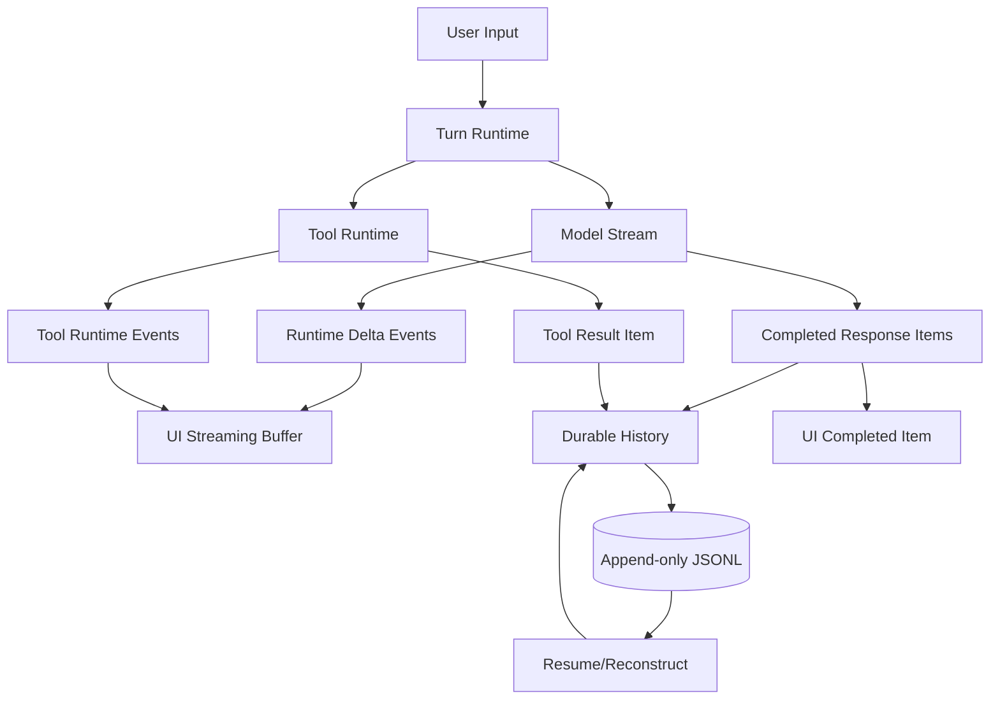

# Codex 与 Claude Code 的 stream event / persisted message 设计调研

本文重新基于源码调研 `openai/codex` 与 `claude-code-sourcemap`，聚焦两个问题：

1. 运行时的 stream event 如何表达、增量合并、交给 UI/SDK。
2. 最终持久化的 message/history 如何设计，如何用于 resume、fork、compact 和回放。

目标不是复刻某个实现，而是抽象出可指导自研 Agent 的设计参考。

## 核心结论

Codex 和 Claude Code 都把“流式事件”和“可持久化历史”拆成两层：

- stream event 是运行时信号，服务 UI 响应、进度展示、审批、工具调用状态、token/usage、错误恢复。
- persisted message 是恢复语义所需的最小事实，优先保存模型可见历史、完整 assistant/user/tool item、少量 replay 所需事件和元数据。

差异在于边界：

- Codex 更倾向于把持久化历史统一为 Responses API 风格的 `ResponseItem`，再通过 `TurnItem`/`EventMsg` 派生 UI 事件。
- Claude Code 更倾向于直接持久化内部 transcript `Message`，用 `parentUuid` 串成链，并把 Anthropic raw stream event 作为实时 UI 输入，完整 assistant message 到达后才进入 transcript。

## Codex: 双轨事件模型

### 运行时协议

Codex 的协议入口在 `codex-rs/protocol/src/protocol.rs`：

- `Submission` 是用户到 agent 的请求队列项。
- `Event` 是 agent 到客户端的事件队列项，包含 `id` 与 `EventMsg`。
- `EventMsg` 是运行时事件总线，覆盖 turn lifecycle、item lifecycle、tool progress、approval、realtime、raw response item、delta 等。

关键事件分组：

- Turn lifecycle: `TurnStarted`, `TurnComplete`, `TurnAborted`, `ThreadRolledBack`, `ContextCompacted`。
- Item lifecycle: `ItemStarted`, `ItemCompleted`。
- Delta: `AgentMessageContentDelta`, `PlanDelta`, `ReasoningContentDelta`, `ReasoningRawContentDelta`。
- Raw model history: `RawResponseItem`。
- Tool/runtime: `ExecCommandBegin/OutputDelta/End`, `McpToolCallBegin/End`, `PatchApply*`, `WebSearch*`。

这形成一个很实用的分层：客户端可以订阅 `ItemStarted/Completed/Delta` 做现代 UI，也可以消费 legacy event 做兼容。

### TurnItem 是 UI 友好的完成态 item

`codex-rs/protocol/src/items.rs` 定义 `TurnItem`：

- `UserMessage`
- `HookPrompt`
- `AgentMessage`
- `Plan`
- `Reasoning`
- `WebSearch`
- `ImageView`
- `ImageGeneration`
- `FileChange`
- `McpToolCall`
- `ContextCompaction`

`codex-rs/core/src/event_mapping.rs` 负责把底层 `ResponseItem` 转成 `TurnItem`。例如 assistant `ResponseItem::Message` 会变为 `TurnItem::AgentMessage`，reasoning item 会变为 `TurnItem::Reasoning`。

这个设计的意义是：不要让 UI 直接理解上游模型的所有 response shape，而是给 UI 一个稳定、领域化的 item 模型。

### 增量与完成态分离

Codex 的增量事件不是最终历史本体。流式过程中可以发：

- `AgentMessageContentDelta`：某个 item 的文本 delta。
- `ReasoningContentDelta`：reasoning summary delta。
- `ReasoningRawContentDelta`：raw reasoning delta。

完成时再发 `ItemCompleted { item: TurnItem }`，其中 item 是完整对象。

`codex-rs/core/src/stream_events_utils.rs` 的关键逻辑是：

- 收到 completed model output item 后，先把 `ResponseItem` 记录进 conversation history 与 rollout。
- 非 tool item 会通过 `parse_turn_item` 转成 `TurnItem`，再发 `ItemStarted`/`ItemCompleted`。
- tool call item 先记录，再排队执行工具，工具结果会转成新的 response item 继续进入历史。

因此 UI 可以：

- 用 delta 做即时打字/进度效果。
- 用 completed item 替换或确认最终展示。
- 用 persisted `ResponseItem` 恢复模型上下文。

### SDK/exec 对外事件

`codex-rs/exec/src/exec_events.rs` 把内部事件再包装成 SDK 友好的 JSONL stream：

- `thread.started`
- `turn.started`
- `item.started`
- `item.updated`
- `item.completed`
- `turn.completed`
- `turn.failed`
- `error`

这是一层面向集成者的稳定抽象。内部 `EventMsg` 可以很丰富，但 SDK 暴露的是更少、更产品化的事件集合。

## Codex: rollout 持久化

### 文件布局与写入模型

Codex 的持久化在 `codex-rs/rollout`：

- 文件是 JSONL。
- 默认目录是 `~/.codex/sessions/YYYY/MM/DD/rollout-<timestamp>-<thread_id>.jsonl`。
- 每行包含 timestamp 与一个 rollout item。
- `RolloutRecorder` 用后台 writer task 写入，避免阻塞主流程。
- 新 session 会延迟 materialize 文件，直到显式 `persist()` 或需要 flush。
- 写失败时保留 pending item，下一次 barrier 重试。

这个 writer 模型值得借鉴：持久化是异步可靠队列，不应该卡住 UI 或 agent loop。

### 持久化哪些东西

`codex-rs/rollout/src/policy.rs` 是最值得看的设计文件。它明确区分：

- `RolloutItem::ResponseItem`：模型历史本体，绝大多数可恢复 item 都保存。
- `RolloutItem::EventMsg`：只保存少量回放/审计需要的事件。
- `RolloutItem::Compacted`、`TurnContext`、`SessionMeta`：恢复、列表、compact 需要的元数据。

`ResponseItem` 保存策略包括：

- message、reasoning
- local shell/function/custom tool call 与 output
- web search、image generation
- compaction/context compaction

不保存：

- `CompactionTrigger`
- `Other`

`EventMsg` limited 模式保存：

- user/agent message legacy event
- reasoning legacy event
- token count
- turn started/complete/aborted
- context compacted
- rollback
- tool/search/image completion等

不保存：

- 大多数 begin/progress/delta 事件
- raw response item event
- approval request
- stream error
- command output delta

一个关键原则：delta/progress 通常不持久化；完成态和恢复语义才持久化。

### RawResponseItem 的角色

`Session::record_conversation_items` 做三件事：

1. 写入内存 history。
2. 持久化为 `RolloutItem::ResponseItem`。
3. 发 `RawResponseItem` 运行时事件。

但 `RawResponseItem` 自身在 rollout policy 中不持久化。也就是说，raw event 是通知客户端“模型历史新增了这个 item”，真正落盘的是 `ResponseItem`。

这是很清晰的边界：event 是传输，item 是事实。

### resume 如何重建 history

`codex-rs/core/src/session/rollout_reconstruction.rs` 从 rollout 重建模型历史：

- 反向扫描 rollout，找到最新 surviving compaction replacement history、turn settings、reference context。
- 处理 rollback：反向扫描时跳过最近 N 个 user-turn segment。
- 正向 replay surviving suffix，把 `ResponseItem` 重新 record 到 `ContextManager`。
- 遇到 `Compacted` 时用 replacement history 替换上下文。

这说明 Codex 并不依赖 parent pointer 链。它把 rollout 看作 append-only event log，通过 replay policy 还原当前模型可见历史。

## Claude Code: raw stream event 与 transcript 链

### SDK message 类型

Claude Code sourcemap 的 SDK schema 在 `restored-src/src/entrypoints/sdk/coreSchemas.ts`：

- `SDKUserMessage`
- `SDKAssistantMessage`
- `SDKResultMessage`
- `SDKSystemMessage`
- `SDKPartialAssistantMessage`
- `SDKCompactBoundaryMessage`
- status/progress/auth/rate-limit/task 等消息

其中 `SDKPartialAssistantMessage` 是：

- `type: "stream_event"`
- `event: RawMessageStreamEvent`
- `parent_tool_use_id`
- `uuid`
- `session_id`

这说明 Claude Code 直接把 Anthropic raw message stream event 暴露为 SDK 层事件，而不是先规范化为 item delta。

### 流式合成 assistant message

`restored-src/src/services/api/claude.ts` 处理 Anthropic stream：

- `message_start` 初始化 partial message。
- `content_block_start` 初始化 content block，并刻意清空 start 里可能重复的 text。
- `content_block_delta` 按 block index 累加 text、tool input JSON、thinking、signature。
- `content_block_stop` 生成一个完整 `AssistantMessage`，推入 `newMessages` 并 yield。
- `message_delta` 更新 usage 与 stop_reason；这里直接 mutate 已 yield message 的 `message.usage` 和 `message.stop_reason`，因为 transcript 写队列可能持有对象引用，直接 mutation 能让最终落盘捕获真实 usage。
- 每个 raw stream event 同时 yield `{ type: "stream_event", event: part }` 给 UI/SDK。

这个设计很细：流事件给 UI，即时完整 assistant block 给 transcript；最终 usage 可能在后到的 `message_delta` 上补齐。

### UI 如何消费 stream event

`restored-src/src/utils/messages.ts` 的 `handleMessageFromStream` 是 UI 聚合器：

- 非 `stream_event` 直接 append 到 messages。
- `message_start` 可记录 TTFT。
- `message_stop` 切换工具执行状态并清空 streaming tool uses。
- `content_block_start` 根据 block 类型设置 stream mode：thinking/responding/tool-input。
- `text_delta` 累加 streaming text。
- `input_json_delta` 累加 streaming tool input。
- `thinking_delta` 只计入响应长度。
- 完整 assistant message 到达时清空 streaming text，再 append message，避免 streaming text 与最终 message 闪烁/重复。

这是一种典型“双缓冲 UI”：

- streaming buffer 用来显示未完成文本。
- durable message list 只放完整 message。

### 远端 stream event 快照化

`restored-src/src/cli/transports/ccrClient.ts` 的 `accumulateStreamEvents` 会把短时间内的 `text_delta` 合并成“full-so-far snapshot”：

- 按 `session_id + parent_tool_use_id` 定义 scope。
- `message_start` 记录 active message id。
- `content_block_delta.text_delta` 累加到 block chunks。
- flush 时每个 touched block 只发一个包含完整累计文本的 snapshot event。

这解决了远端/重连场景中的一个重要问题：客户端中途连接时，收到的是当前块完整快照，而不是不可理解的碎片 delta。

### transcript 持久化模型

`restored-src/src/utils/sessionStorage.ts` 是 Claude Code transcript 核心：

- 文件路径：`~/.claude/projects/<sanitized-project-dir>/<session-id>.jsonl`。
- transcript message 类型包括 user、assistant、attachment、system。
- progress 是 ephemeral，不应该参与 transcript chain。
- 每条 transcript message 附加：
  - `parentUuid`
  - `logicalParentUuid`
  - `isSidechain`
  - `cwd`
  - `userType`
  - `sessionId`
  - `timestamp`
  - `version`
  - `gitBranch`
  - `slug`
  - agent/team metadata

写入时 `insertMessageChain` 会：

- 用 `parentUuid` 串起 message chain。
- compact boundary 的 `parentUuid` 设为 null，并保存 `logicalParentUuid`。
- tool result user message 可以用 `sourceToolAssistantUUID` 指向产生 tool_use 的 assistant message。
- session metadata 迟到/重写，以确保 resume picker 能在 tail window 中读到 title/tag/last prompt 等。

与 Codex 不同，Claude Code 的恢复核心是 parent pointer chain，而不是纯 replay。

### transcript 写入策略

`restored-src/src/hooks/useLogMessages.ts` 监听 React `messages`：

- message list 在 compaction 之间近似 append-only。
- 只把新增 tail 交给 `recordTranscript`，避免每次 render 全量扫描。
- compaction 或 `/clear` 会改变 first uuid，此时走 full-array dedup。
- `lastParentUuidRef` 维护增量写入的 parent hint。

`recordTranscript` 会：

- `cleanMessagesForLogging`
- 读已有 message set 去重。
- 已记录的 prefix 可以作为 parent；compaction 中保留的旧 message 不会错误地推进 parent。
- 最终调用 `insertMessageChain`。

这是一个很现实的 UI 状态到持久化状态同步方案，尤其适合前端 message array 频繁 render 的 CLI/TUI。

### transcript 读取与恢复

`loadTranscriptFile` 做了很多大型会话优化与兼容：

- 大文件跳过 pre-compact stale bytes。
- 可在 parse 前按 parent chain 裁剪死分支。
- 读取 metadata-only entries。
- 兼容旧 transcript 中 progress entry 进入 parent chain 的问题，用 bridge map 跳过 progress。
- 计算 leaf UUID，只把 user/assistant 作为 resume anchor。
- compact preserved segment 会在内存中 relink。

核心思想是：append-only JSONL 会变得很大，所以恢复层必须有裁剪、桥接、兼容、leaf selection 逻辑。

## 对比

| 维度 | Codex | Claude Code |
| --- | --- | --- |
| 运行时事件 | `EventMsg` 总线，含 turn/item/delta/tool/approval | SDK message union，`stream_event` 直接包 raw Anthropic event |
| UI 完成态 | `TurnItem` | 内部 `Message` / React transcript message |
| 模型历史本体 | `ResponseItem` | user/assistant/system/attachment transcript message |
| 持久化文件 | rollout JSONL | transcript JSONL |
| 恢复方式 | event log replay + compaction replacement history | parentUuid chain + leaf selection |
| delta 是否持久化 | 通常不持久化 | raw stream event 通常用于实时/远端，不作为本地 transcript 本体 |
| compact 设计 | `Compacted` item 替换 history | compact boundary message 截断/重接 chain |
| SDK 输出 | 简化成 `thread/turn/item` 事件 | 暴露较接近内部/Anthropic stream 的 SDK message |

## 自研 Agent 设计建议

### 1. 明确三层模型

建议定义三套类型，不要混用：

```ts
type RuntimeEvent =
  | TurnStarted
  | ItemStarted
  | ItemDelta
  | ItemCompleted
  | ToolProgress
  | ApprovalRequested
  | TurnCompleted
  | TurnFailed;

type DurableItem =
  | UserMessage
  | AssistantMessage
  | Reasoning
  | ToolCall
  | ToolResult
  | FileChange
  | Compaction;

type UiItem =
  | AgentMessageView
  | ToolCallView
  | PlanView
  | ReasoningView
  | ErrorView;
```

RuntimeEvent 服务“现在发生了什么”；DurableItem 服务“以后如何恢复”；UiItem 服务“怎么显示”。

### 2. delta 不要作为恢复事实

delta/progress 可以丢、可以合并、可以快照化。恢复应依赖 completed item 或 durable item。

如果要支持远端重连，可以借鉴 Claude Code：

- 本地 UI 使用增量 delta。
- 远端传输把 text delta 合并成 full-so-far snapshot。
- 完整 message 到达后清理 accumulator。

### 3. 持久化优先保存模型可见历史

最小推荐持久化内容：

- user message
- assistant message
- tool call
- tool result
- reasoning summary，可选
- file/web/search/image 这类外部上下文 item
- compaction boundary 或 replacement history
- turn started/completed/aborted
- usage/token count
- session meta、cwd、model、permission/sandbox profile、git info

不推荐持久化：

- 每个 token delta
- spinner/progress
- command stdout delta
- transient approval popup
- begin event，除非没有 completed event 可表达最终状态

### 4. 选择一种恢复范式

如果你的 Agent 更像 Codex，建议用 replay：

- append-only log。
- 每个 completed durable item 顺序写入。
- resume 时重放 durable item 到 context manager。
- rollback/compact 作为 log 中的控制事件。

适合：

- 多端 SDK。
- 后端或 CLI 共享同一 history。
- 需要 fork/rollback/compact 的长期演进。

如果你的 Agent 更像 Claude Code，建议用 parent chain：

- 每条 message 有 `id` 与 `parentId`。
- resume 从 leaf 回溯。
- fork/sidechain 更自然。

适合：

- 树状会话、多分支、subagent sidechain。
- transcript 中存在多个 leaf。
- 需要从任意 message 分叉。

也可以混合：主 history 用 replay，fork/branch 加 parent pointer。但不要让 UI delta 参与 parent chain。

### 5. 写入层要异步、可重试、可 flush

借鉴 Codex `RolloutRecorder`：

- agent loop 只 enqueue。
- 后台 writer 执行 JSONL append。
- `flush()`/`shutdown()` 作为可靠 barrier。
- 失败时保留 pending suffix，下一次重试。

借鉴 Claude Code：

- UI message array 频繁更新时，只记录新增 tail。
- 去重用 message id set。
- compact 后要小心旧 message 不应推进 parent cursor。

### 6. compact 要保存“恢复语义”，不是只保存摘要文本

compact 至少需要：

- compact summary message 或 compact item。
- 被替换历史的边界。
- replacement history 或可重建信息。
- compact 之后 reference context/settings 的基线。

否则 resume 后很容易出现：UI 看起来有摘要，但模型上下文缺关键系统/工具/权限状态。

### 7. 对外 SDK 事件应比内部事件少

内部可以有丰富事件总线；SDK 最好只暴露：

- `thread.started`
- `turn.started`
- `item.started`
- `item.updated`
- `item.completed`
- `turn.completed`
- `turn.failed`
- `error`

特殊能力用 typed item 扩展，而不是无限扩展顶层 event。

## 推荐参考架构



关键不变量：

- `item.completed` 必须能独立渲染，不依赖之前的 delta。
- `DurableItem` 必须能独立恢复模型上下文，不依赖 UI event。
- `RuntimeEvent` 可以丢失或合并，但不能破坏 durable history。
- `flush()` 成功后，resume 必须得到同样的 durable history。

## 源码索引

Codex:

- `codes/codex/codex-rs/protocol/src/protocol.rs`
- `codes/codex/codex-rs/protocol/src/items.rs`
- `codes/codex/codex-rs/core/src/event_mapping.rs`
- `codes/codex/codex-rs/core/src/stream_events_utils.rs`
- `codes/codex/codex-rs/core/src/session/mod.rs`
- `codes/codex/codex-rs/core/src/session/rollout_reconstruction.rs`
- `codes/codex/codex-rs/rollout/src/policy.rs`
- `codes/codex/codex-rs/rollout/src/recorder.rs`
- `codes/codex/codex-rs/exec/src/exec_events.rs`

Claude Code sourcemap:

- `codes/claude-code-sourcemap/restored-src/src/entrypoints/sdk/coreSchemas.ts`
- `codes/claude-code-sourcemap/restored-src/src/services/api/claude.ts`
- `codes/claude-code-sourcemap/restored-src/src/utils/messages.ts`
- `codes/claude-code-sourcemap/restored-src/src/remote/sdkMessageAdapter.ts`
- `codes/claude-code-sourcemap/restored-src/src/cli/transports/ccrClient.ts`
- `codes/claude-code-sourcemap/restored-src/src/utils/sessionStorage.ts`
- `codes/claude-code-sourcemap/restored-src/src/hooks/useLogMessages.ts`
- `codes/claude-code-sourcemap/restored-src/src/types/logs.ts`
