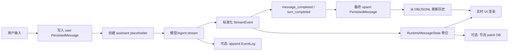

# Stream 与入库消息形态调研

本文调研当前仓库内 8 个应用对“消息目录/消息列表”的设计方式，重点回答两个问题：

1. 消息在实时生成过程中以什么形态流动。
2. 消息在入库、恢复、分页、搜索、上下文组装时以什么形态保存。

结论先说清楚：不要把 stream chunk 直接等同于入库消息。主流实现都会拆成两层，复杂项目还会再增加运行时聚合态和原始事件日志。

## 术语

本文使用以下术语，避免把不同层级混在一起：

| 术语 | 定义 | 生命周期 | 是否适合直接渲染 | 是否适合入库为主表 |
| --- | --- | --- | --- | --- |
| Raw Provider Event | 模型 SDK、ACP、PTY、SSE 产生的原始事件 | 极短，随 provider 变化 | 通常不适合 | 不适合，除非作为审计日志 |
| Stream Event | 应用归一化后的实时事件，如 text delta、tool update、done | 一轮生成期间 | 适合实时渲染 | 不适合作为最终消息 |
| Runtime Aggregate State | 前端或服务端把 stream event 折叠后的运行中状态 | 一轮生成期间到服务端追平 | 适合渲染 | 可定期更新同一条 DB row |
| Persisted Message | 入库后的稳定消息，如 UIChatMessage、TMessage、ConversationMessage | 长期 | 适合历史渲染 | 适合 |
| Event Log | 原始或标准化事件的追加日志 | 长期或调试期 | 不直接渲染 | 适合作为回放/审计辅助表 |

用户说的“两种形态”，对应的是 Stream Event 和 Persisted Message。实际设计时建议至少显式区分这两层；如果要支持断线恢复、回放、复杂工具调用，再增加 Runtime Aggregate State 和 Event Log。

## 总体对比

| 应用 | Stream 形态 | 入库/历史形态 | 折叠策略 | 适合借鉴点 |
| --- | --- | --- | --- | --- |
| acpx | `AcpRuntimeEvent`，通过 `AsyncIterable` 输出 | `SessionRecord.messages` + `eventLog` | ACP `session/update` 转 runtime event，再由 session record 保存最终会话 | 协议事件和持久会话记录分层很清晰 |
| Claude Code UI | WebSocket `NormalizedMessage`，含 `stream_delta`、`stream_end` | 后端 JSONL 历史；前端 `serverMessages` | `realtimeMessages` 和 `serverMessages` 合并去重 | 前端“双轨合并”适合断线与服务端追平 |
| Claude Code sourcemap | Anthropic raw stream event 包成 `StreamEvent`，并额外产出完整 `AssistantMessage` | `~/.claude/projects/<project>/<session>.jsonl` transcript，每行是完整 message 或 metadata entry | `content_block_delta` 按 block index 聚合，`content_block_stop` 生成完整 assistant message；JSONL 用 `parentUuid` 串链 | 最接近 Claude Code CLI 内核，适合参考 transcript、resume、compact、sidechain 设计 |
| AionUi | ACP `sessionUpdate` 转 `TMessage` | 数据库 `TMessage` | 通过 `msg_id`、`toolCallId`、`sessionId` 合并 | `composeMessage` 对文本、工具、计划的合并规则明确 |
| LobeHub | `StreamingHandler` 累积 text、reasoning、tools | PostgreSQL `messages`、`message_plugins` 等 | stream 更新前端，finish 时写回消息行并刷新 | 乐观更新 + 完成落库 + 完整刷新 |
| Proma | Chat SSE；Agent `AgentEventBus` + IPC `STREAM_EVENT` | Chat/Agent JSONL | 前端 Jotai atom 保存运行中状态，最终 append JSONL | 本地应用使用 JSONL 简洁可靠 |
| AgentAPI | PTY screen diff 或 ACP chunk | `ConversationMessage`；PTY 可保存 `AgentState` JSON | 最后一条 agent 消息原地覆盖 | 终端类应用的替换式流式模型 |
| JetBrains CC GUI | `MessageCallback.onMessage(type, content)` 字符串事件 | Provider history 转前端消息；`SDKResult.messages` | 上层 handler 识别字符串 type | 简单接入多 provider，但类型安全弱 |

## 关键结论

### 1. Stream 不是消息，stream 是“消息变更事件”

Stream 事件通常只有以下职责：

- 把新 token 追加到某个输出流。
- 更新某个工具调用的状态。
- 通知 usage、permission、error、done 等控制信息。
- 给 UI 提供低延迟反馈。

它不天然具备最终消息需要的属性：稳定内容、完整 metadata、完整 tool result、最终 usage、可查询外键、可恢复排序。

### 2. 入库消息是“折叠后的事实快照”

入库消息至少应该回答这些问题：

- 谁说的：`role`。
- 属于哪里：`sessionId`、`topicId`、`threadId`、`agentId`。
- 说了什么：`content` 或 `blocks`。
- 关联什么：`parentId`、`toolCallId`、`messageGroupId`。
- 当前状态：`status`、`error`、`interrupted`。
- 可审计字段：`createdAt`、`updatedAt`、`provider`、`model`、`usage`。

入库消息是历史、搜索、恢复、上下文拼装的 source of truth。

### 3. 大多数实现中间还有“运行中聚合态”

典型例子：

- Claude Code UI 用 `realtimeMessages` 保存实时消息，用 `serverMessages` 保存历史消息，再计算 `merged`。
- Claude Code sourcemap 在 `handleMessageFromStream` 中把 raw stream event 转为 streaming text、streaming thinking、streaming tool uses 等运行时展示态。
- AionUi 用 `composeMessage` 把相同 `msg_id` 的文本 chunk 合并成一条消息。
- LobeHub 用 `StreamingHandler.output`、`thinkingContent`、`tools` 保存当前轮聚合状态。
- Proma 用 Jotai `streamingStatesAtom` / `agentStreamingStatesAtom` 保存运行中状态。

这层是 stream 与入库之间的缓冲区，能减少 DB 写压力，也能避免 chunk 级数据污染历史记录。

## 各应用实现细节

### acpx

acpx 的设计最接近协议型架构，分为 runtime event 和 session record。

Stream 形态：

```ts
type AcpRuntimeEvent =
  | { type: 'text_delta'; text: string; stream?: 'output' | 'thought'; tag?: AcpSessionUpdateTag }
  | { type: 'status'; text: string; used?: number; size?: number }
  | { type: 'tool_call'; text: string; toolCallId?: string; status?: string; rawInput?: unknown }
  | { type: 'done'; stopReason?: string }
  | { type: 'error'; message: string; code?: string; retryable?: boolean };
```

入库形态：

```ts
type SessionMessage =
  | { User: SessionUserMessage }
  | { Agent: SessionAgentMessage }
  | 'Resume';

type SessionRecord = {
  schema: 'acpx.session.v1';
  acpxRecordId: string;
  acpSessionId: string;
  eventLog: SessionEventLog;
  messages: SessionMessage[];
  cumulative_token_usage: SessionTokenUsage;
  request_token_usage: Record<string, SessionTokenUsage>;
};
```

转换逻辑：

- ACP `agent_message_chunk` 转为 `text_delta`，`stream='output'`。
- ACP `agent_thought_chunk` 转为 `text_delta`，`stream='thought'`。
- ACP `tool_call` 和 `tool_call_update` 转为 `tool_call` runtime event。
- session record 保存折叠后的 `User/Agent/Resume`。
- `eventLog` 另存 JSON-RPC 事件，可用于审计和回放。

设计判断：

- acpx 明确区分“协议事件”和“会话记录”。
- 如果后续系统需要回放 agent 过程，应该参考 acpx 保留 event log。
- 如果只关心聊天历史，主查询应使用 `SessionRecord.messages`，不要从 event log 即时重放。

相关代码：

- `codes/acpx/src/runtime/public/contract.ts`
- `codes/acpx/src/types.ts`
- `codes/acpx/src/session/persistence/repository.ts`

### Claude Code UI

Claude Code UI 的特点是 provider-neutral：所有 provider 的实时和历史消息都转为 `NormalizedMessage`。

统一消息类型：

```ts
type MessageKind =
  | 'text'
  | 'tool_use'
  | 'tool_result'
  | 'thinking'
  | 'stream_delta'
  | 'stream_end'
  | 'error'
  | 'complete'
  | 'status'
  | 'permission_request'
  | 'permission_cancelled'
  | 'session_created'
  | 'interactive_prompt'
  | 'task_notification';

type NormalizedMessage = {
  id: string;
  sessionId: string;
  timestamp: string;
  provider: LLMProvider;
  kind: MessageKind;
  role?: 'user' | 'assistant';
  content?: string;
  toolName?: string;
  toolInput?: unknown;
  toolId?: string;
  toolResult?: unknown;
};
```

前端状态：

```ts
type SessionSlot = {
  serverMessages: NormalizedMessage[];
  realtimeMessages: NormalizedMessage[];
  merged: NormalizedMessage[];
  status: 'idle' | 'loading' | 'streaming' | 'error';
  total: number;
  hasMore: boolean;
  offset: number;
};
```

转换和合并流程：

1. WebSocket 收到 `stream_delta`。
2. 前端把 delta 追加到 `accumulatedStreamRef`。
3. 每 100ms 更新一次 `__streaming_<sessionId>` 临时消息。
4. 收到 `stream_end` 后，把临时消息转成普通 `text` 消息。
5. 后端 JSONL 历史通过 REST 拉取，进入 `serverMessages`。
6. `computeMerged(server, realtime)` 去重，服务端追平后清空 `realtimeMessages`。

设计判断：

- 这是非常值得参考的前端模型。
- 它允许实时消息和历史消息同时存在，避免刷新时 UI 闪烁。
- 它承认“服务端最终消息 ID”和“前端临时流式 ID”可能不同，通过去重处理最终一致性。

相关代码：

- `codes/claudecodeui/src/stores/useSessionStore.ts`
- `codes/claudecodeui/src/components/chat/hooks/useChatRealtimeHandlers.ts`
- `codes/claudecodeui/server/shared/types.ts`

### Claude Code sourcemap

`claude-code-sourcemap` 是从 `@anthropic-ai/claude-code` npm 包 sourcemap 还原出的 Claude Code 2.1.88 源码。它不是一个普通 UI 应用，而更接近 Claude Code CLI 内核本身，所以它对“stream 事件”和“transcript 入库消息”的分层最值得单独看。

核心结论：

- 实时阶段直接消费 Anthropic raw stream event，但包成内部 `StreamEvent`。
- UI 不把每个 delta 当最终消息，而是在 `handleMessageFromStream` 中维护 streaming text、streaming thinking、streaming tool uses。
- 持久化不是 DB row，而是 append-only JSONL transcript。
- transcript 的主数据不是 chunk，而是完整 `user` / `assistant` / `system` / `attachment` message。
- 每条 transcript message 都有 `uuid` 和 `parentUuid`，通过链式关系支持 resume、fork、compact、sidechain。

Stream 输出形态：

```ts
type QueryYield =
  | StreamEvent
  | RequestStartEvent
  | Message
  | TombstoneMessage
  | ToolUseSummaryMessage;

type RequestStartEvent = {
  type: 'stream_request_start';
};

type StreamEvent = {
  type: 'stream_event';
  event: BetaRawMessageStreamEvent;
  ttftMs?: number;
};
```

其中 `BetaRawMessageStreamEvent` 主要来自 Anthropic Messages streaming API：

| raw event | 作用 | Claude Code 处理方式 |
| --- | --- | --- |
| `message_start` | 初始化本轮 assistant message、usage | 保存 `partialMessage`，记录 TTFT 和初始 usage |
| `content_block_start` | 开始一个 content block | 按 `index` 初始化 `contentBlocks[index]`，区分 text、thinking、tool_use、server_tool_use |
| `content_block_delta` | 文本、thinking 或 tool input 增量 | 追加到 `contentBlocks[index]`；同时原样 yield `stream_event` 给 UI/SDK |
| `content_block_stop` | 一个 block 完成 | 用该 block 创建完整 `AssistantMessage`，立刻 yield 这个 message |
| `message_delta` | 最终 usage、stop_reason | 回写到最后一个已生成的 assistant message |
| `message_stop` | 本轮 stream 完成 | 通知 UI stream 结束、清空 streaming tool uses |

这里有一个很重要的设计点：Claude Code 不是等整个 assistant response 全部结束后才创建 assistant message，而是在每个 `content_block_stop` 处创建一个完整 `AssistantMessage`。因此一个模型响应如果包含多个 content block，可能会变成多条 assistant message；这些 message 用各自的 `uuid` 表示，但共享同一个 request 过程。

Assistant message 的生成逻辑可以概括为：

```ts
const assistantMessage: AssistantMessage = {
  type: 'assistant',
  uuid: randomUUID(),
  timestamp: new Date().toISOString(),
  requestId: streamRequestId,
  message: {
    ...partialMessage,
    content: normalizeContentFromAPI([contentBlock], tools, agentId),
  },
};
```

UI 运行时聚合：

```ts
function handleMessageFromStream(
  message:
    | Message
    | TombstoneMessage
    | StreamEvent
    | RequestStartEvent
    | ToolUseSummaryMessage,
  onMessage: (message: Message) => void,
  onUpdateLength: (newContent: string) => void,
  onSetStreamMode: (mode: SpinnerMode) => void,
  onStreamingToolUses: (
    f: (streamingToolUse: StreamingToolUse[]) => StreamingToolUse[],
  ) => void,
  onTombstone?: (message: Message) => void,
  onStreamingThinking?: (
    f: (current: StreamingThinking | null) => StreamingThinking | null,
  ) => void,
  onApiMetrics?: (metrics: { ttftMs: number }) => void,
  onStreamingText?: (f: (current: string | null) => string | null) => void,
): void;
```

运行时行为：

- `stream_request_start` 把 UI 模式设为 `requesting`。
- `message_start` 可记录 `ttftMs`。
- `content_block_start:text` 把 UI 模式设为 `responding`。
- `content_block_start:thinking` 把 UI 模式设为 `thinking`。
- `content_block_start:tool_use` 把 UI 模式设为 `tool-input`，并创建一个 `StreamingToolUse`。
- `content_block_delta:text_delta` 追加到 `streamingText`，也更新 response length。
- `content_block_delta:input_json_delta` 追加到对应 tool use 的 `unparsedToolInput`。
- `content_block_delta:thinking_delta` 只更新长度；完整 thinking block 在 assistant message 到达后再用于 transcript 展示。
- 非 stream 的完整 `assistant` / `user` / `system` message 到达时，清空 `streamingText`，再追加到正式 messages。
- `tombstone` 会删除已产生的 message，同时调用 `removeTranscriptMessage` 删除 transcript 中的孤儿消息。

这说明 Claude Code 的 UI 层有三类对象同时存在：

| 对象 | 来源 | 用途 | 是否入 transcript |
| --- | --- | --- | --- |
| `StreamEvent` | raw provider event 包装 | 驱动 spinner、streaming text、streaming tool input | 不作为主消息入库 |
| `Message` | user 输入、assistant block 完成、system 事件 | 正式显示、上下文拼装、transcript 写入 | 是 |
| `TombstoneMessage` | streaming fallback 或异常恢复 | 删除孤儿 assistant message | 本身不作为主消息，作用于已有 transcript |

SDK / remote 形态：

```ts
type SDKPartialAssistantMessage = {
  type: 'stream_event';
  event: RawMessageStreamEvent;
  parent_tool_use_id: string | null;
  uuid: string;
  session_id: string;
};

type SDKAssistantMessage = {
  type: 'assistant';
  message: APIAssistantMessage;
  parent_tool_use_id: string | null;
  error?: SDKAssistantMessageError;
  uuid: string;
  session_id: string;
};
```

remote adapter 的策略也很清楚：

- SDK `stream_event` 转回内部 `StreamEvent`。
- SDK `assistant` 转成内部 `AssistantMessage`。
- 普通 user message 在 live WS 模式通常忽略，因为本地 REPL 已经把用户输入加入 UI。
- tool_result user message 可选择转换，因为它需要和远端工具结果一起展示。

入库形态：

```ts
type SerializedMessage = Message & {
  cwd: string;
  userType: string;
  entrypoint?: string;
  sessionId: string;
  timestamp: string;
  version: string;
  gitBranch?: string;
  slug?: string;
};

type TranscriptMessage = SerializedMessage & {
  parentUuid: UUID | null;
  logicalParentUuid?: UUID | null;
  isSidechain: boolean;
  gitBranch?: string;
  agentId?: string;
  teamName?: string;
  agentName?: string;
  agentColor?: string;
  promptId?: string;
};
```

本地 transcript 路径：

```text
~/.claude/projects/<sanitized-project-dir>/<sessionId>.jsonl
~/.claude/projects/<sanitized-project-dir>/<sessionId>/subagents/agent-<agentId>.jsonl
```

写入规则：

1. session 文件不会在启动时立即创建，而是在第一条 `user` 或 `assistant` message 出现时 `materializeSessionFile`。
2. 写入前调用 `cleanMessagesForLogging`：
   - `progress` 不入 transcript。
   - 外部用户默认过滤大部分 attachment。
   - 对外部用户隐藏 REPL wrapper，把虚拟 REPL tool use / tool result 转成更自然的原生工具历史。
3. `recordTranscript` 根据 message `uuid` 去重，只把新 message 交给 `insertMessageChain`。
4. `insertMessageChain` 给每条 transcript message 补充 `cwd`、`sessionId`、`timestamp`、`version`、`gitBranch`、`slug`。
5. `parentUuid` 默认指向上一条链上 message。
6. 如果 user message 是 tool result，并带有 `sourceToolAssistantUUID`，则 `parentUuid` 指向触发该 tool use 的 assistant message。
7. compact boundary 的 `parentUuid` 写成 `null`，同时用 `logicalParentUuid` 保存逻辑父节点。
8. 实际写文件不是同步逐条落盘，而是进入 per-file write queue，默认 100ms drain 一次，批量 append JSONL。

transcript JSONL 不只有 message，也有 metadata entry：

| entry type | 作用 |
| --- | --- |
| `summary` | session 摘要 |
| `custom-title` / `ai-title` | 会话标题 |
| `last-prompt` | 最近一次真实用户 prompt，用于 resume 列表 |
| `tag` | 用户标签 |
| `agent-name` / `agent-color` / `agent-setting` | agent 展示和恢复信息 |
| `worktree-state` | worktree 会话状态 |
| `content-replacement` | 记录大内容替换，resume 时恢复 prompt cache 语义 |
| `file-history-snapshot` | 文件历史快照 |
| `attribution-snapshot` | 文件贡献归因 |
| compact 相关 entry | 支持 compact 后恢复上下文链 |

读取恢复：

- `loadTranscriptFile` 读取 JSONL。
- 对大文件先做 pre-compact skip，避免解析大量已经被 compact 截断的旧内容。
- `isTranscriptMessage` 只把 `user`、`assistant`、`attachment`、`system` 作为 transcript 主消息。
- 旧版本里可能存在 `progress` 进入 parent chain 的情况，读取时会用 `progressBridge` 把链桥接到最近的非 progress 父节点。
- 最终通过 `parentUuid` 找到可恢复的 conversation chain，而不是简单取文件里所有行。

远端/bridge stream 传输：

Claude Code 还有一层用于远端 session 的 `HybridTransport`：

- WebSocket 负责读。
- HTTP POST 负责写。
- `stream_event` 会先在内存 buffer 最多 100ms，减少高频 delta 的 POST 次数。
- 非 stream event 会先 flush 已缓存的 stream event，再发送自己，保证顺序。
- POST 侧用串行 batch uploader，避免并发写同一个远端 session。

这层说明一个设计边界：`stream_event` 可以进入远端事件通道，但不等于本地 transcript 主消息。它更像 event transport 或 event log，而不是最终 message store。

设计判断：

- Claude Code sourcemap 是“event + final message + transcript chain”组合最完整的参考。
- 它没有简单采用“一条 assistant response = 一条消息”的模型，而是按 content block 生成 assistant message，这对工具调用和 thinking 展示很友好，但要求展示层能做 group / collapse。
- `message_delta` 回写 usage 和 stop_reason 到最后一条 assistant message，是为了让 transcript 捕获最终 usage；如果后续设计使用数据库，建议用显式 final update，而不是依赖对象引用在 flush 前被修改。
- `parentUuid` 比单纯 `createdAt` 排序更适合 resume、fork、compact、删除孤儿 message。
- `progress` 被排除在 transcript 主链外，这一点非常关键。进度事件适合 UI 和 event log，不适合进入长期上下文。
- 如果我们要支持 Claude Code 风格的 fork、compact、subagent、remote session，应该参考它的 JSONL transcript + metadata entry + parent chain，而不是只存扁平消息列表。

相关代码：

- `codes/claude-code-sourcemap/restored-src/src/query.ts`
- `codes/claude-code-sourcemap/restored-src/src/services/api/claude.ts`
- `codes/claude-code-sourcemap/restored-src/src/utils/messages.ts`
- `codes/claude-code-sourcemap/restored-src/src/utils/sessionStorage.ts`
- `codes/claude-code-sourcemap/restored-src/src/hooks/useLogMessages.ts`
- `codes/claude-code-sourcemap/restored-src/src/types/logs.ts`
- `codes/claude-code-sourcemap/restored-src/src/entrypoints/sdk/coreSchemas.ts`
- `codes/claude-code-sourcemap/restored-src/src/remote/sdkMessageAdapter.ts`
- `codes/claude-code-sourcemap/restored-src/src/cli/transports/HybridTransport.ts`

### AionUi

AionUi 的核心是 `TMessage`，同一个结构既用于 UI，又会被写入本地数据库。

消息类型：

```ts
type TMessageType =
  | 'text'
  | 'tips'
  | 'tool_call'
  | 'tool_group'
  | 'agent_status'
  | 'acp_permission'
  | 'acp_tool_call'
  | 'codex_permission'
  | 'codex_tool_call'
  | 'plan'
  | 'thinking'
  | 'available_commands'
  | 'skill_suggest'
  | 'cron_trigger';

interface IMessage<T extends TMessageType, Content> {
  id: string;
  msg_id?: string;
  conversation_id: string;
  type: T;
  content: Content;
  createdAt?: number;
  position?: 'left' | 'right' | 'center' | 'pop';
  status?: 'finish' | 'pending' | 'error' | 'work';
}
```

Stream 转换：

- `agent_message_chunk` 转为 `text`。
- 同一段 assistant 输出复用同一个 `msg_id`。
- 每个 chunk 可以有独立 `id`，但 `msg_id` 相同，用于合并。
- `tool_call` / `tool_call_update` 转为 `acp_tool_call`，以 `toolCallId` 作为 `msg_id`。
- `plan` 复用当前 turn 的 `currentPlanMsgId`。

合并规则：

| 类型 | 合并键 | 合并行为 |
| --- | --- | --- |
| `text` | `msg_id` + 相邻同 type | 追加 `content.content` |
| `thinking` | `msg_id` | 追加 thinking 文本，done 时只更新状态 |
| `tool_call` | `content.callId` | 更新已有 tool call |
| `codex_tool_call` | `content.toolCallId` | 更新已有 tool call |
| `acp_tool_call` | `content.update.toolCallId` | 更新状态、content、rawInput |
| `tool_group` | 每个工具的 `callId` | 合并已有工具，剩余工具新建 |
| `plan` | `content.sessionId` | 合并同 session 的 plan |

入库策略：

- `addMessage` 直接插入。
- `addOrUpdateMessage` 走 `accumulate`。
- `ConversationManageWithDB` 先读取最近消息，再用同一套 `composeMessage` 计算 insert/update。
- `insert` 立即 flush；`accumulate` 延迟 2 秒 flush，降低 DB 写压力。

设计判断：

- AionUi 的优势是 UI 合并和 DB 合并使用同一套逻辑，前后表现一致。
- 风险是 `TMessage` 同时承载 UI 和持久层，长期会让 UI 字段进入数据库。
- 后续设计可保留 `msg_id` 思路，但最好区分 `StreamMessagePatch` 和 `PersistedMessage`。

相关代码：

- `codes/AionUi/src/common/chat/chatLib.ts`
- `codes/AionUi/src/process/agent/acp/AcpAdapter.ts`
- `codes/AionUi/src/process/utils/message.ts`
- `codes/AionUi/src/process/bridge/databaseBridge.ts`

### LobeHub

LobeHub 的消息模型最像完整产品形态：DB schema、service、store、stream handler 分层较全。

持久层：

- `messages` 表保存 role、content、reasoning、search、metadata、model、provider、tools、traceId、sessionId、topicId、threadId、parentId、agentId、groupId 等。
- `message_plugins` 表保存 tool call 相关字段，如 `toolCallId`、`apiName`、`arguments`、`state`、`error`、`intervention`。
- `message_groups` 表支持多模型并行和压缩组。

前端状态：

```ts
type ChatMessageState = {
  dbMessagesMap: Record<string, UIChatMessage[]>;
  messagesMap: Record<string, UIChatMessage[]>;
  messagesInit: boolean;
};
```

其中：

- `dbMessagesMap` 是原始数据库消息。
- `messagesMap` 是经过 `conversation-flow` parse 后的展示消息。
- 修改时先更新 `dbMessagesMap`，再 parse 成 `messagesMap`。

Stream 处理：

```ts
class StreamingHandler {
  private output = '';
  private thinkingContent = '';
  private tools?: ChatToolPayload[];

  handleChunk(chunk: StreamChunk): void;
  handleFinish(finishData: FinishData): Promise<StreamingResult>;
}
```

关键流程：

1. 发送前创建用户消息和 assistant placeholder。
2. LLM 回调 `onMessageHandle(chunk)` 时进入 `StreamingHandler.handleChunk`。
3. 文本 chunk 更新 `output`，reasoning chunk 更新 `thinkingContent`，tool chunk 更新 `tools`。
4. 每次更新通过 `internal_dispatchMessage` 乐观更新前端 store。
5. `onFinish` 调用 `handler.handleFinish` 得到完整结果。
6. `optimisticUpdateMessageContent` 调用 `messageService.updateMessage` 写入数据库。
7. 服务端返回完整 messages，前端 `replaceMessages` 刷新 DB 消息列表。

设计判断：

- LobeHub 的设计适合有服务端 DB、复杂工具调用、多 agent、多话题的应用。
- 它把 stream 聚合逻辑收在 `StreamingHandler`，避免分散在 UI 组件里。
- 它使用“乐观前端更新 + 完成后权威刷新”的最终一致性策略。

相关代码：

- `codes/lobehub/src/store/chat/agents/StreamingHandler.ts`
- `codes/lobehub/src/store/chat/agents/createAgentExecutors.ts`
- `codes/lobehub/src/store/chat/slices/message/actions/query.ts`
- `codes/lobehub/packages/database/src/schemas/message.ts`
- `codes/lobehub/packages/database/src/models/message.ts`

### Proma

Proma 同时有 Chat 模式和 Agent 模式，两套流式通道相互独立。

Chat 模式：

- 请求使用 SSE。
- `streamSSE` 负责通用 SSE 读取。
- provider adapter 解析各家格式。
- 通过 IPC 推送：
  - `STREAM_CHUNK`
  - `STREAM_REASONING`
  - `STREAM_TOOL_ACTIVITY`
  - `STREAM_COMPLETE`
  - `STREAM_ERROR`
- 前端 `streamingStatesAtom` 以 `conversationId` 为 key 存运行中状态。

Chat 入库：

- 会话索引在 `~/.proma/conversations.json`。
- 消息逐行追加到 `~/.proma/conversations/{id}.jsonl`。
- 用户消息发送前 append。
- assistant 完成后 append。

Agent 模式：

- SDK 消息进入 `AgentEventBus`。
- `AgentEventBus.emit(sessionId, payload)` 经中间件后分发。
- IPC `AGENT_IPC_CHANNELS.STREAM_EVENT` 推给渲染进程。
- 前端把 payload 转成 legacy event，再折叠进 `agentStreamingStatesAtom`。

Agent 入库：

- 会话索引在 `~/.proma/agent-sessions.json`。
- 消息逐行追加到 `~/.proma/agent-sessions/{id}.jsonl`。
- 新格式直接追加 `SDKMessage`，读取时通过 `type` 区分新旧格式。

设计判断：

- JSONL 非常适合桌面本地应用：简单、可 append、可恢复、可人工排查。
- 如果需要复杂查询和多维筛选，JSONL 后期会吃力，需要额外索引或迁移到 DB。
- Chat 与 Agent 通道拆开后，两个模式可以同时运行，互不污染。

相关代码：

- `codes/Proma/packages/core/src/providers/sse-reader.ts`
- `codes/Proma/apps/electron/src/main/lib/chat-service.ts`
- `codes/Proma/apps/electron/src/main/lib/conversation-manager.ts`
- `codes/Proma/apps/electron/src/main/lib/agent-session-manager.ts`
- `codes/Proma/apps/electron/src/main/lib/agent-event-bus.ts`
- `codes/Proma/apps/electron/src/renderer/atoms/chat-atoms.ts`
- `codes/Proma/apps/electron/src/renderer/atoms/agent-atoms.ts`

### AgentAPI

AgentAPI 是终端/PTY 风格应用，核心目标不是保留所有 chunk，而是从屏幕变化中抽取最新对话。

API 消息：

```go
type Message struct {
    Id      int
    Content string
    Role    ConversationRole
    Time    time.Time
}

type MessageRequestBody struct {
    Content string
    Type    MessageType // "user" | "raw"
}
```

内部消息：

```go
type ConversationMessage struct {
    Id      int
    Message string
    Role    ConversationRole // "user" | "agent"
    Time    time.Time
}
```

PTY stream 策略：

1. 定时读取 terminal screen。
2. `screenDiff(oldScreen, newScreen)` 算 agent 最新输出。
3. 如果最后一条是 user，则追加新的 agent 消息。
4. 如果最后一条是 agent，则原地覆盖最后一条 agent 消息。
5. EventEmitter 假设只有最后一条消息会变化，向订阅者发 `message_update`。

持久化：

```go
type AgentState struct {
    Version           int
    Messages          []ConversationMessage
    InitialPrompt     string
    InitialPromptSent bool
}
```

`SaveState` 全量写一个 JSON 文件，使用 temp file + rename 原子替换。

特殊点：

- `MessageTypeRaw` 直接写入 PTY，不保存到历史。
- ACP 模式也使用 placeholder agent 消息，chunk 到来时覆盖最后一条 agent 消息。

设计判断：

- 替换式策略适合终端代理，因为屏幕本身就是一个不断变化的 snapshot。
- 不适合需要审计每个工具步骤的应用。
- 如果采用该策略，应明确约束：只能追加新消息或更新最后一条消息。

相关代码：

- `codes/agentapi/lib/httpapi/models.go`
- `codes/agentapi/lib/screentracker/conversation.go`
- `codes/agentapi/lib/screentracker/pty_conversation.go`
- `codes/agentapi/x/acpio/acp_conversation.go`
- `codes/agentapi/lib/httpapi/events.go`

### JetBrains CC GUI

CC GUI 是最轻量的回调式设计。

Stream 接口：

```java
public interface MessageCallback {
    void onMessage(String type, String content);
    void onError(String error);
    void onComplete(SDKResult result);
}
```

常见 type：

| type | 含义 |
| --- | --- |
| `content` | 完整内容 |
| `content_delta` | 文本增量 |
| `thinking_delta` | thinking 增量 |
| `stream_start` | 流开始 |
| `stream_end` | 流结束 |
| `message_end` | 消息结束 |
| `session_id` | 会话 ID |
| `tool_result` | 工具结果 |
| `usage` | token usage |

结果对象：

```java
public class SDKResult {
    public boolean success;
    public String error;
    public int messageCount;
    public List<Object> messages;
    public String rawOutput;
    public String finalResult;
}
```

历史恢复：

- `SessionMessageOrchestrator` 从 provider 读取 session history。
- 清空当前 state。
- 将 provider history parse 成 `ClaudeSession.Message`。
- 通知前端刷新。

设计判断：

- 字符串 type 接入快，但后续维护成本高。
- 如果后续要统一多 provider，建议尽快升级为 discriminated union，而不是继续扩展字符串。

相关代码：

- `codes/jetbrains-cc-gui/src/main/java/com/github/claudecodegui/provider/common/MessageCallback.java`
- `codes/jetbrains-cc-gui/src/main/java/com/github/claudecodegui/provider/common/SDKResult.java`
- `codes/jetbrains-cc-gui/src/main/java/com/github/claudecodegui/session/ClaudeMessageHandler.java`
- `codes/jetbrains-cc-gui/src/main/java/com/github/claudecodegui/session/SessionMessageOrchestrator.java`

## 格式设计参考

下面给出一个可落地的格式设计。它不完全照搬任何一个项目，而是提取共同模式。

### 第一层：StreamEvent

StreamEvent 是实时事件，不是最终消息。

```ts
type StreamEvent =
  | StreamTextDelta
  | StreamReasoningDelta
  | StreamContentPart
  | StreamToolCallStarted
  | StreamToolCallDelta
  | StreamToolCallCompleted
  | StreamToolResult
  | StreamPermissionRequest
  | StreamUsageUpdate
  | StreamMessageCompleted
  | StreamTurnCompleted
  | StreamError;

type StreamEventBase = {
  eventId: string;
  sessionId: string;
  turnId: string;
  seq: number;
  at: string;
  provider?: string;
  model?: string;
  rawType?: string;
};

type StreamTextDelta = StreamEventBase & {
  type: 'assistant_text_delta';
  streamId: string;
  messageId?: string;
  delta: string;
};

type StreamReasoningDelta = StreamEventBase & {
  type: 'assistant_reasoning_delta';
  streamId: string;
  messageId?: string;
  delta: string;
  signature?: string;
};

type StreamToolCallStarted = StreamEventBase & {
  type: 'tool_call_started';
  messageId?: string;
  toolCallId: string;
  name: string;
  title?: string;
  kind?: 'read' | 'edit' | 'execute' | 'search' | 'mcp' | 'unknown';
  input?: unknown;
  inputText?: string;
};

type StreamToolCallDelta = StreamEventBase & {
  type: 'tool_call_delta';
  toolCallId: string;
  inputDelta?: string;
  status?: 'pending' | 'in_progress';
};

type StreamToolCallCompleted = StreamEventBase & {
  type: 'tool_call_completed';
  toolCallId: string;
  status: 'completed' | 'failed' | 'cancelled';
  input?: unknown;
  output?: unknown;
  error?: MessageError;
};

type StreamUsageUpdate = StreamEventBase & {
  type: 'usage_update';
  usage: TokenUsage;
};

type StreamMessageCompleted = StreamEventBase & {
  type: 'message_completed';
  messageId: string;
  finishReason?: string;
};

type StreamTurnCompleted = StreamEventBase & {
  type: 'turn_completed';
  stopReason?: string;
};

type StreamError = StreamEventBase & {
  type: 'error';
  messageId?: string;
  error: MessageError;
};
```

字段说明：

| 字段 | 必要性 | 说明 |
| --- | --- | --- |
| `eventId` | 必须 | 去重、审计、重放 |
| `sessionId` | 必须 | 会话归属 |
| `turnId` | 必须 | 一次用户输入到模型完成的完整回合 |
| `seq` | 必须 | 流内排序；断线重连后避免乱序 |
| `streamId` | 文本/思考必需 | 同一段文本流的聚合键，类似 AionUi 的 `msg_id` |
| `messageId` | 推荐 | 如果 assistant placeholder 已创建，则绑定最终消息 |
| `toolCallId` | 工具事件必需 | 工具调用聚合键 |
| `rawType` | 可选 | 记录 provider 原始事件名，方便调试 |

设计约束：

- `delta` 必须只表达增量，不应该塞完整消息，除非事件名叫 snapshot。
- 所有事件必须带 `seq`，否则断线重放会很麻烦。
- StreamEvent 可以被丢弃或压缩；最终历史不能依赖前端保留它。
- tool input 可能是 partial JSON，不要强行 parse 成对象。保留 `inputText`，完成时再写 `input`。

### 第二层：RuntimeMessageState

RuntimeMessageState 是内存中的聚合状态，用于实时渲染。

```ts
type RuntimeMessageState = {
  sessionId: string;
  turnId: string;
  messageId: string;
  status: 'creating' | 'streaming' | 'requires_action' | 'completed' | 'error' | 'cancelled';
  role: 'assistant';
  content: string;
  reasoning?: {
    content: string;
    signature?: string;
    durationMs?: number;
  };
  toolCalls: RuntimeToolCallState[];
  usage?: TokenUsage;
  error?: MessageError;
  updatedAt: string;
};

type RuntimeToolCallState = {
  toolCallId: string;
  name: string;
  status: 'pending' | 'in_progress' | 'requires_permission' | 'completed' | 'failed';
  inputText?: string;
  input?: unknown;
  output?: unknown;
  error?: MessageError;
};
```

这层可以参考：

- Claude Code UI 的 `realtimeMessages`。
- Proma 的 `streamingStatesAtom`。
- LobeHub 的 `StreamingHandler` 内部字段。
- AionUi 的 `composeMessage` 聚合结果。

推荐策略：

- 前端 UI 优先读 RuntimeMessageState。
- 服务端可选择每 500ms 到 2s 把 RuntimeMessageState patch 到 DB。
- 完成时必须生成一次权威 PersistedMessage。

### 第三层：PersistedMessage

PersistedMessage 是入库主表或 JSONL 的核心结构。

```ts
type PersistedMessage = {
  id: string;
  sessionId: string;
  topicId?: string | null;
  threadId?: string | null;
  agentId?: string | null;
  groupId?: string | null;
  turnId?: string;

  role: 'system' | 'user' | 'assistant' | 'tool';
  status: 'completed' | 'streaming' | 'requires_action' | 'error' | 'cancelled' | 'interrupted';

  content: string;
  blocks?: MessageBlock[];

  parentId?: string | null;
  toolCallId?: string | null;
  messageGroupId?: string | null;

  provider?: string | null;
  model?: string | null;
  reasoning?: PersistedReasoning | null;
  tools?: PersistedToolCall[];
  usage?: TokenUsage;
  error?: MessageError | null;
  metadata?: Record<string, unknown>;

  createdAt: string;
  updatedAt: string;
};

type MessageBlock =
  | { type: 'text'; text: string }
  | { type: 'image'; fileId?: string; url?: string; mimeType?: string }
  | { type: 'file'; fileId: string; name?: string; mimeType?: string }
  | { type: 'reasoning'; text: string; signature?: string }
  | { type: 'tool_call'; toolCallId: string }
  | { type: 'tool_result'; toolCallId: string; content: string; isError?: boolean };

type PersistedToolCall = {
  toolCallId: string;
  name: string;
  title?: string;
  kind?: string;
  status: 'pending' | 'in_progress' | 'requires_permission' | 'completed' | 'failed' | 'cancelled';
  input?: unknown;
  inputText?: string;
  output?: unknown;
  error?: MessageError | null;
  intervention?: {
    status: 'pending' | 'approved' | 'rejected' | 'aborted' | 'none';
    optionId?: string;
    reason?: string;
  };
};

type PersistedReasoning = {
  content?: string;
  signature?: string;
  durationMs?: number;
  redacted?: boolean;
};

type TokenUsage = {
  inputTokens?: number;
  outputTokens?: number;
  cacheReadTokens?: number;
  cacheCreationTokens?: number;
  totalTokens?: number;
  costUsd?: number;
};

type MessageError = {
  code?: string;
  message: string;
  retryable?: boolean;
  detail?: unknown;
};
```

字段设计理由：

| 字段 | 为什么需要 |
| --- | --- |
| `id` | 入库消息稳定主键 |
| `turnId` | 把一次用户请求内的 assistant、tool、permission、usage 关联起来 |
| `status` | 区分完成、流式中、报错、中断、等待用户操作 |
| `blocks` | 支持多模态、reasoning、tool result，而不把所有内容压成字符串 |
| `parentId` | 支持 assistant 回复关联 user 消息、tool 关联 assistant |
| `toolCallId` | 工具消息和 assistant message 中的 tool call 对齐 |
| `messageGroupId` | 支持多模型并行、压缩摘要、agent group |
| `metadata` | 扩展字段，但不要把关键查询字段只放在 metadata |

### 第四层：PersistedEventLog

如果需要回放、审计、debug，建议加事件日志表或 JSONL。

```ts
type PersistedEventLog = {
  id: string;
  sessionId: string;
  turnId?: string;
  seq: number;
  direction: 'inbound' | 'outbound' | 'internal';
  event: StreamEvent | unknown;
  raw?: unknown;
  createdAt: string;
};
```

保存原则：

- EventLog 是辅助数据，不作为默认消息查询源。
- 可以设置 retention，例如只保留最近 30 天或每个 session 最多 N MB。
- 如果保存 raw provider payload，需要注意敏感信息脱敏。

## 推荐数据流

推荐采用以下完整数据流：



明确执行规则：

1. 用户消息可以立即入库，因为它是稳定事实。
2. assistant 消息建议先创建 placeholder，获得稳定 `messageId`。
3. stream event 只更新 RuntimeMessageState。
4. 如果需要刷新后仍看到生成中状态，可以节流更新 placeholder 行。
5. 完成时用完整内容、reasoning、tools、usage、finishReason 更新同一条 assistant 消息。
6. 前端最终以 DB/JSONL 返回的历史为准，清空或去重 realtime 状态。

## 入库策略对比

| 策略 | 做法 | 优点 | 缺点 | 适用场景 |
| --- | --- | --- | --- | --- |
| 完成后一次入库 | stream 只在内存聚合，finish 后写完整消息 | DB 压力最低，历史最干净 | 刷新会丢失生成中内容 | 简单聊天、可接受生成中刷新丢失 |
| placeholder + 节流 update | 先插入 assistant 空消息，stream 中每隔一段时间更新同一行 | 刷新可恢复部分内容 | DB 写更多，需要处理并发覆盖 | 产品级聊天、多端同步 |
| event log + final snapshot | 每个事件 append log，完成后写最终消息 | 可回放、可 debug、审计好 | 存储量大，查询复杂 | Agent、工具链、企业审计 |
| transcript chain JSONL | 每条完整消息或 metadata entry 一行，用 `parentUuid` 串链 | resume、fork、compact、sidechain 语义强 | 读取逻辑复杂，需要链恢复和去重 | Claude Code 类 CLI、本地 agent |
| JSONL append | 每条完整消息或 SDK message 一行 | 本地简单、迁移方便 | 查询和索引弱 | 桌面本地应用 |
| 替换式 snapshot | 始终覆盖最后一条 agent 消息或整个 state 文件 | 实现简单，适合终端输出 | 不保留细粒度过程 | PTY/终端类应用 |

推荐默认策略：`placeholder + RuntimeMessageState + finish upsert`。如果需要调试和回放，再加 `event log`。

## 设计时必须明确的边界

### 1. StreamEvent 的 ID 与 PersistedMessage 的 ID 不一定相同

可以有三种 ID：

- `eventId`：每个事件唯一。
- `streamId`：同一段文本或 reasoning 的聚合键。
- `messageId`：最终入库消息 ID。

不要只用一个 `id` 解决全部问题。AionUi 的 `id + msg_id`、Claude Code UI 的 `__streaming_<session>` 都是在处理这个问题。

### 2. 工具调用必须按 toolCallId 聚合

工具调用通常分阶段出现：

1. 模型开始吐出 tool call。
2. tool input 以 partial JSON 形式流式到达。
3. input 完整。
4. 等待权限。
5. 工具执行中。
6. 工具完成或失败。
7. tool result 回写。

所以工具不应该只保存在 assistant 文本里。至少要有：

- `toolCallId`
- `name`
- `status`
- `inputText`
- `input`
- `output`
- `error`
- `intervention`

### 3. Reasoning 要和普通文本分开

reasoning/thinking 可能有：

- 可展示文本。
- signature。
- redacted thinking。
- duration。
- 多模态 thinking block。

不要把 reasoning 混进 `content`。否则后续无法单独隐藏、折叠、回传签名或做安全策略。

### 4. 控制事件不要入库成普通消息

以下事件通常不应该直接进入 `messages` 主表：

- `status`
- `usage_update`
- `stream_start`
- `stream_end`
- `session_created`
- `available_commands_update`
- `config_option_update`

它们可以更新 session state、usage 表、event log，或只影响 UI。

### 5. 中断和错误要有明确状态

不要只在 content 后面拼接错误文本。建议：

```ts
status: 'error' | 'cancelled' | 'interrupted';
error: {
  code: 'MODEL_TIMEOUT',
  message: 'request timed out',
  retryable: true
};
```

这样历史、重试、UI 样式、统计才能准确处理。

### 6. 前端展示态和 DB 原始态要分开

LobeHub 的 `dbMessagesMap` / `messagesMap` 是一个好例子：

- `dbMessagesMap` 保存数据库原始消息。
- `messagesMap` 保存 parse 后的展示结构。

原因是展示层可能会做：

- assistant group。
- compressed group。
- tool group。
- branch/thread 展开。
- 临时 UI 状态。

这些不一定适合作为 DB 主结构。

### 7. Transcript 型存储不是简单消息数组

Claude Code sourcemap 说明了另一类本地 agent 存储：transcript 是 append-only JSONL，但读取时不是“按文件顺序全部渲染”。

它至少有四层含义：

- 行级追加：每一行是 message 或 metadata entry。
- 消息链：主消息通过 `uuid` / `parentUuid` 串成 conversation chain。
- 元数据流：标题、tag、worktree、content replacement、compact 信息用独立 entry 表达。
- 恢复算法：resume 时根据 parent chain、compact boundary、sidechain 信息重建可用上下文。

因此如果采用 transcript JSONL，格式里必须显式设计：

```ts
type TranscriptMessage = PersistedMessage & {
  uuid: string;
  parentUuid: string | null;
  logicalParentUuid?: string | null;
  isSidechain: boolean;
  agentId?: string;
  cwd: string;
  entrypoint?: string;
  version: string;
};

type TranscriptEntry =
  | { type: 'message'; message: TranscriptMessage }
  | { type: 'summary'; leafUuid: string; summary: string }
  | { type: 'custom-title'; sessionId: string; customTitle: string }
  | { type: 'content-replacement'; sessionId: string; replacements: unknown[] }
  | { type: 'worktree-state'; sessionId: string; worktreeSession: unknown | null };
```

如果后续只做普通聊天，关系型 `messages` 表更简单；如果要做 Claude Code 式 resume、fork、compact、subagent，必须把 `parentUuid` 和 metadata entry 作为一等设计。

## 推荐表结构

如果采用关系型数据库，可以这样拆：

```sql
messages (
  id text primary key,
  session_id text not null,
  topic_id text null,
  thread_id text null,
  agent_id text null,
  group_id text null,
  turn_id text null,
  role text not null,
  status text not null,
  content text null,
  blocks jsonb null,
  parent_id text null,
  message_group_id text null,
  provider text null,
  model text null,
  reasoning jsonb null,
  tools jsonb null,
  usage jsonb null,
  error jsonb null,
  metadata jsonb null,
  created_at timestamptz not null,
  updated_at timestamptz not null
);

message_tool_calls (
  id text primary key,
  message_id text not null,
  tool_call_id text not null,
  name text not null,
  status text not null,
  input jsonb null,
  input_text text null,
  output jsonb null,
  error jsonb null,
  intervention jsonb null,
  created_at timestamptz not null,
  updated_at timestamptz not null
);

message_events (
  id text primary key,
  session_id text not null,
  turn_id text null,
  seq integer not null,
  direction text not null,
  event jsonb not null,
  raw jsonb null,
  created_at timestamptz not null
);
```

索引建议：

```sql
create index messages_session_created_idx on messages (session_id, created_at);
create index messages_topic_created_idx on messages (topic_id, created_at);
create index messages_thread_created_idx on messages (thread_id, created_at);
create index messages_parent_idx on messages (parent_id);
create index messages_turn_idx on messages (turn_id);
create unique index message_tool_calls_tool_call_id_idx on message_tool_calls (tool_call_id);
create unique index message_events_session_seq_idx on message_events (session_id, seq);
```

如果用 JSONL：

- 一个 session 一个 JSONL 文件。
- 每行必须有 `type`。
- 完整消息用 `{type:'message', message: PersistedMessage}`。
- 事件日志用 `{type:'event', event: StreamEvent}`。
- meta 更新用 `{type:'meta', patch:{...}}`。

示例：

```jsonl
{"type":"message","message":{"id":"u1","role":"user","content":"hello","status":"completed"}}
{"type":"event","event":{"type":"assistant_text_delta","seq":1,"delta":"hi"}}
{"type":"message","message":{"id":"a1","role":"assistant","content":"hi","status":"completed"}}
```

读取时只把 `message` 类型作为历史主数据，`event` 类型用于调试或重放。

## 后续设计建议

如果我们要设计自己的消息目录，推荐这样定：

1. 明确两个主接口：
   - `appendStreamEvent(event: StreamEvent)`
   - `upsertPersistedMessage(message: PersistedMessage)`
2. 前端不要直接消费 raw provider event，必须先标准化为 StreamEvent。
3. StreamEvent 只负责实时变化，PersistedMessage 负责长期事实。
4. 每个 turn 创建稳定 `turnId`，每个 assistant placeholder 创建稳定 `messageId`。
5. 文本、thinking、tool 都用不同 event type，不要都塞进 `content_delta`。
6. 工具调用用 `toolCallId` 做全链路聚合键。
7. 入库采用 `placeholder + finish upsert`，同时允许节流 patch。
8. 如果需要 replay/debug，单独存 `message_events`，不要污染 `messages` 主表。
9. UI 使用 `persistedMessages + runtimeState` 合并渲染，服务端追平后清理 runtime。
10. DB 原始消息和 UI 展示消息分离，展示层可以派生 group、branch、tool panel。

最推荐的参考组合：

- 协议和事件分层：参考 acpx。
- 前端实时/历史合并：参考 Claude Code UI。
- Claude Code CLI transcript、resume、compact、sidechain：参考 Claude Code sourcemap。
- 按 ID 合并 chunk、tool、plan：参考 AionUi。
- 产品级 DB schema 和乐观更新：参考 LobeHub。
- 本地 JSONL 方案：参考 Proma。
- 终端 screen snapshot 场景：参考 AgentAPI。

## 来源文档

- `docs/message-formats/README.md`
- `docs/message-formats/acpx.md`
- `docs/message-formats/claudecodeui.md`
- `codes/claude-code-sourcemap/restored-src/src/query.ts`
- `codes/claude-code-sourcemap/restored-src/src/services/api/claude.ts`
- `codes/claude-code-sourcemap/restored-src/src/utils/messages.ts`
- `codes/claude-code-sourcemap/restored-src/src/utils/sessionStorage.ts`
- `codes/claude-code-sourcemap/restored-src/src/hooks/useLogMessages.ts`
- `codes/claude-code-sourcemap/restored-src/src/types/logs.ts`
- `codes/claude-code-sourcemap/restored-src/src/entrypoints/sdk/coreSchemas.ts`
- `codes/claude-code-sourcemap/restored-src/src/remote/sdkMessageAdapter.ts`
- `codes/claude-code-sourcemap/restored-src/src/cli/transports/HybridTransport.ts`
- `docs/message-formats/AionUi.md`
- `docs/message-formats/lobehub.md`
- `docs/message-formats/proma.md`
- `docs/message-formats/agentapi.md`
- `docs/message-formats/jetbrains-cc-gui.md`
