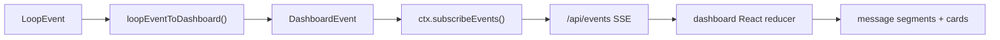

# DeepSeek-Reasonix 专题分析：Agent 产品与协议设计参考

调研对象：`codes/DeepSeek-Reasonix`

调研版本：`6c8650d2beec06db54cc29a460a1a329a45e6287`，提交信息为 `fix(desktop): wire memoryDetail/onReadMemory through test fixtures`。

本文面向自研 Agent 设计参考，不做泛泛的项目介绍，而是重点回答：

1. DeepSeek-Reasonix 的优势是什么。
2. 这些优势在代码里是如何实现的。
3. 在线网页和桌面端采用了什么设计风格。
4. 前端用什么组件库实现 AI 对话框和 AI Stream Event 消息显示。
5. Stream Event 与持久化 Message 是怎么设计的。
6. 还有哪些适合学习的工程实践。

## 1. 项目定位

Reasonix 是一个 DeepSeek-native coding agent。它不是通用 LLM wrapper，而是围绕 DeepSeek 的 prefix cache、reasoning_content、tool calling 失败模式、长会话成本和终端工作流做了强约束设计。

官方架构文档把它概括为三根主要支柱：

- Cache-first loop：让请求前缀尽量保持字节稳定，提高 DeepSeek prefix cache 命中。
- Tool-call repair：修复 DeepSeek/R1 系模型在工具调用上的实际失败模式。
- Cost control：默认使用低成本模型档位，压缩大工具结果，暴露每轮成本与 cache hit。

从代码看，它的主心智模型是：

```text
ImmutablePrefix     稳定系统提示词 + 工具定义 + few-shots
AppendOnlyLog       只追加的 OpenAI/DeepSeek chat messages
VolatileScratch     reasoning、计划等临时状态，不直接进入下一轮请求
LoopEvent           运行时 UI 事件
Event sidecar       可重放、可审计的 typed event log
Session JSONL       用于继续会话的 ChatMessage 持久化
Transcript JSONL    用于成本、cache、diff、replay 的运行收据
```

## 2. 主要优势与实现机制

### 2.1 Cache-first loop：围绕 prefix cache 设计 Agent 循环

优势：

- 长会话成本低，可持续运行。
- cache 命中率可以被解释、度量和回放。
- 适合 DeepSeek 这类按 prefix cache 收费显著不同的模型。

实现方式：

- `src/memory/runtime.ts` 定义 `ImmutablePrefix`、`AppendOnlyLog` 和 `VolatileScratch`。
- `ImmutablePrefix` 把 system prompt、tool specs、few-shots 分区管理，并用 SHA-256 生成 `fingerprint`。
- `AppendOnlyLog` 默认只允许 append；只有 compact/recovery 可以 `compactInPlace`。
- `CacheFirstLoop.buildMessages()` 每次请求都按 `prefix.toMessages() + log.toMessages()` 组装，避免中间重排。
- `src/telemetry/stats.ts` 和 `Usage` 记录 `prompt_cache_hit_tokens` / `prompt_cache_miss_tokens`。
- benchmark 文档用真实/模拟任务证明 cache hit 与成本差异，例如 `benchmarks/tau-bench/report.md` 和 `benchmarks/real-world-cache/README.md`。

可学习点：

- 如果目标模型有 prefix cache，不要只在“调用层”开 cache，而要把整个 agent loop 设计成 cache-friendly。
- prompt、tool spec、memory、history 的稳定性应该成为架构不变量。
- `prefixHash` 是非常好的观测字段，可以定位“为什么这轮 cache 掉了”。

### 2.2 Tool-call repair：把模型失败模式变成协议层补偿

优势：

- 不把工具调用失败都交给模型“自我反思”。
- 能修复 reasoning 中漏出的 DSML/tool JSON。
- 能限制重复 tool-call storm。
- 能在参数 JSON 截断时做低成本修复。

实现方式：

- `src/repair/index.ts` 定义 repair pass 顺序：`scavenge -> truncation -> storm`。
- `src/repair/scavenge.ts` 从 reasoning/content 中扫描 DSML invoke block、OpenAI-style function call JSON、`tool_name/tool_args` 变体。
- `src/repair/truncation.ts` 修复不完整 JSON。
- `src/repair/storm.ts` 用滑动窗口检测相同 `(tool, args)` 重复调用，读操作重复到阈值后抑制。
- `CacheFirstLoop.step()` 在模型返回后调用 `this.repair.process(toolCalls, reasoningContent, assistantContent)`，然后把修复后的 calls 写入 assistant message。
- storm 全部抑制时，会把原始 tool calls 写回尾部 assistant message，并插入 stub tool response，让模型有一次自纠机会。

可学习点：

- Tool calling 不应该只依赖 provider 的理想协议；Agent 应有 provider-specific repair layer。
- repair report 要被事件和 UI 记录下来，否则调试时看不到“模型本来做错了什么，系统帮它修了什么”。
- storm breaker 需要区分 read-only 与 mutating tool，避免“编辑后再读”被误判为重复。

### 2.3 成本控制：模型档位、工具结果压缩和可视化成本

优势：

- 默认低成本，必要时升档。
- 大工具结果不会无限拖进后续上下文。
- UI 层直接暴露 cost/cache，让用户理解 agent 是否值得继续跑。

实现方式：

- `CacheFirstLoop` 默认模型为 `deepseek-v4-flash`，reasoning effort 默认 `high`。
- `src/loop/shrink.ts` 对超大 tool result 和 tool call arguments 做 token-aware shrink。
- session load 时会 heal/shrink 旧消息，避免恢复旧会话后下一轮请求直接爆上下文。
- `src/context-manager.ts` 负责 fold/compact 策略。
- `src/telemetry/stats.ts` 记录 `TurnStats`、`SessionSummary`、cost、cache hit ratio。
- Desktop/Dashboard 的 status bar 和 context panel 读取 usage/cost/cache 字段。

可学习点：

- 成本控制不是单个“max token”参数，而是模型选择、工具输出生命周期、上下文压缩、UI 透明度的组合。
- 工具结果应有“本轮完整、后续摘要、需要时可重读”的生命周期。

### 2.4 Runtime Event 与 durable Message 分层

优势：

- UI 可以实时显示 reasoning、文本增量、工具开始/结束、审批弹窗。
- 持久化上下文保持 provider API 需要的 ChatMessage 形状。
- sidecar event log 可以支持审计、replay、未来 reducer。

实现方式：

- `src/loop/types.ts` 定义运行时 `LoopEvent`，包括：
  - `assistant_delta`
  - `assistant_final`
  - `tool_call_delta`
  - `tool_start`
  - `tool`
  - `done`
  - `error`
  - `warning`
  - `status`
  - `steer`
- `src/types.ts` 定义真正进入模型上下文和 session JSONL 的 `ChatMessage`：
  - `role: system | user | assistant | tool`
  - `content`
  - `tool_calls`
  - `tool_call_id`
  - `reasoning_content`
- `src/core/events.ts` 定义更稳定、更产品化的 typed event kernel：
  - `user.message`
  - `model.turn.started`
  - `model.delta`
  - `model.final`
  - `tool.preparing`
  - `tool.intent`
  - `tool.dispatched`
  - `tool.result`
  - `session.compacted`
  - `policy.escalated`
  - `warning`
  - `error`
- `src/core/eventize.ts` 把低层 `LoopEvent` 转换为 typed kernel events。
- `src/adapters/event-sink-jsonl.ts` 持久化 `.events.jsonl`，但故意跳过 `model.delta`，避免事件 sidecar 被 token delta 膨胀。
- `src/core/reducers.ts` 用纯 reducer 从 event log 投影 conversation、budget、plan、workspace、capabilities、status、session meta。

可学习点：

- UI stream event 不等于持久化 message。
- delta 事件适合 transient UI state；最终 message 应以 completed/final 事件或 API response 为准。
- 事件日志可以比 message 历史更产品化，例如记录审批、预算、checkpoint、capability registry。

### 2.5 桌面端与网页端共享协议，但 transport 不同

优势：

- Web dashboard 和 Desktop UI 可以复用相似的 `IncomingEvent` / `OutgoingCommand`。
- Desktop 不需要把核心逻辑重写到 Rust/Tauri 里，核心仍在 Node/TypeScript。
- Web dashboard 可以直接接入 CLI 运行时。

实现方式：

- Desktop 是 Tauri 2 + React + Vite。
- `desktop/src-tauri/src/rpc.rs` 启动 Node sidecar，stdin 写 JSON command，stdout 逐行读 JSON event，然后通过 Tauri `rpc:event` 发给 WebView。
- `src/cli/commands/desktop.ts` 是 Desktop sidecar daemon，维护 tabs、session、toolset、runtime，并通过 `emit()` 输出 JSON line。
- `desktop/src/App.tsx` 监听 `rpc:event`，把 JSON parse 成 `IncomingEvent`，通过 reducer 更新 UI。
- Web dashboard 使用 HTTP API + SSE：
  - `src/server/api/events.ts` 返回 `text/event-stream`。
  - `src/server/context.ts` 定义 `DashboardEvent`。
  - `src/cli/ui/effects/loop-to-dashboard.ts` 把 `LoopEvent` 转换成 `DashboardEvent`。

可学习点：

- “同一语义协议，不同传输层”是好的桌面/Web 复用方式。
- Desktop 的主进程只做进程管理、文件系统桥、窗口集成；Agent 核心保持在同一 Node runtime，降低分叉成本。

## 3. 在线网页和桌面端采用的设计风格

这里要区分三类界面：官网、Web Dashboard/在线仪表盘、桌面端。

### 3.1 官网：Editorial / Engineering Brief

位置：

- `docs/src/styles.css`
- `docs/src/hero.jsx`
- `docs/src/features.jsx`

风格关键词：

- 深色 warm ink 背景。
- cream 前景文字。
- 单一 sodium/ochre 橙色强调色。
- serif display + Geist body + Geist Mono。
- generous whitespace、hairline、marginalia。
- 不是 SaaS landing page，而是工程白皮书/产品宣言式页面。

代码里甚至直接写明了设计方向：

```text
Direction: deep warm ink, cream foreground, single sodium accent.
Type: Instrument Serif display · Geist body · Geist Mono.
Principle: restraint, hairlines, generous whitespace, marginalia.
```

官网 hero 不是抽象插画，而是一个 animated terminal，展示真实 Reasonix coding session：cache hit、cost、tool call、SEARCH/REPLACE edit、test passed。这是一个很强的产品策略：第一屏就把“它如何工作”说清楚。

### 3.2 Web Dashboard：TUI heritage + web fluency

位置：

- `docs/design/agent-dashboard.html`
- `dashboard/src/styles.css`
- `dashboard/src/App.tsx`

风格关键词：

- 深色工程工具界面。
- GitHub dark family 色系：sky、purple、green、amber、coral。
- 小圆角或接近直角，密集但可扫视。
- sidebar + main thread + context panel + status bar 的工作台布局。
- 不是终端模拟器，而是“终端 companion”：长会话阅读、chart、文件/工具/技能/memory 浏览、modal 审批。

设计稿里明确写了定位：

```text
NOT a TUI mirror. Does what the TUI cannot:
- long-form session reading
- real charts
- multi-file editing
- browsing inventories
```

### 3.3 桌面端：Tauri 原生壳里的工程工作台

位置：

- `desktop/src-tauri/tauri.conf.json`
- `desktop/src/styles.css`
- `desktop/src/App.tsx`

风格与 dashboard 基本同源，但更强调桌面 app 质感：

- macOS 下透明/圆角窗口边界、无系统装饰、自绘 titlebar。
- grid app shell：title、tabs、sidebar、main thread、context panel、status。
- 支持多 tab、可折叠侧栏/上下文栏、可调整宽度。
- 字体支持 Geist、Inter、system、serif，可调字号。
- 主题风格包括 graphite、sandstone、porcelain、midnight。

桌面端不是 Electron，而是 Tauri 2；React 只负责 UI，Rust 负责窗口、进程和系统桥接，Node sidecar 负责 Agent runtime。

## 4. 前端组件库与 AI 对话框实现

### 4.1 没有使用大型 UI 组件库

Dashboard 与 Desktop 的 `package.json` 都没有 Ant Design、MUI、Radix UI、shadcn/ui 这类组件库。主要依赖是：

- `react`
- `react-dom`
- `lucide-react`
- `react-markdown`
- `react-virtuoso`
- `prism-react-renderer`
- `katex`
- `remark-gfm`
- `remark-math`
- `rehype-katex`

也就是说，它的 AI 对话框、消息列表、工具卡片、审批卡片、命令面板、设置面板基本都是自研组件 + CSS tokens。

### 4.2 AI 对话框

核心文件：

- `dashboard/src/ui/composer.tsx`
- `desktop/src/ui/composer.tsx`
- `dashboard/src/App.tsx`
- `desktop/src/App.tsx`

Composer 能力：

- textarea 输入。
- Enter 发送，busy 时可排队发送。
- `/` slash command popup。
- `@` 文件/目录 mention popup。
- attach file/image。
- model picker。
- reasoning effort picker。
- edit mode segmented control：plan/review/auto/yolo。
- busy label 和 elapsed timer。
- abort。

设计上，composer 不是一个简单输入框，而是 Agent 控制面板：模型、努力程度、编辑权限、附件、slash command、运行状态都在同一交互区。

### 4.3 AI Stream Event 消息显示

核心文件：

- `dashboard/src/ui/thread.tsx`
- `desktop/src/ui/thread.tsx`
- `dashboard/src/ui/cards.tsx`
- `desktop/src/ui/cards.tsx`
- `dashboard/src/ui/live.tsx`
- `desktop/src/ui/live.tsx`
- `dashboard/src/Markdown.tsx`
- `desktop/src/Markdown.tsx`
- `dashboard/src/CodeView.tsx`
- `desktop/src/CodeView.tsx`

消息显示不是直接渲染 markdown 字符串，而是把 assistant message 拆成 `AssistantSegment[]`：

```ts
type AssistantSegment =
  | { kind: "text"; text: string }
  | { kind: "reasoning"; text: string }
  | {
      kind: "tool";
      callId: string;
      name: string;
      args: string;
      startedAt: number;
      result?: string;
      ok?: boolean;
      durationMs?: number;
    };
```

不同 segment 对应不同 UI：

- `text` -> `AssistantText` + Markdown。
- `reasoning` -> `ReasoningCard`，可折叠，streaming 时默认展开。
- `tool` -> `ToolCard`。
- shell 工具 -> `ShellCard`，支持 awaiting/running/done/failed。
- edit tool result -> Desktop 里进一步转成 `DiffCard`。
- plan -> `PlanCardView` / `PlanBanner` / approval card。
- checkpoint、choice、path access、confirm -> `ApprovalCard` / `TaskCard`。

这套设计的关键是：stream event 不是 UI 文本，而是逐步构建结构化 message segments。

## 5. Stream Event 与 Message 设计

Reasonix 至少有四层“消息/事件”概念，不能混为一谈。

### 5.1 Provider SSE chunk：DeepSeek 原始流

位置：`src/client.ts`

`DeepSeekClient.stream()` 调用 `/chat/completions`，用 `eventsource-parser` 解析 SSE，然后转成内部 `StreamChunk`：

```ts
interface StreamChunk {
  contentDelta?: string;
  reasoningDelta?: string;
  toolCallDelta?: {
    index: number;
    id?: string;
    name?: string;
    argumentsDelta?: string;
  };
  usage?: Usage;
  finishReason?: string;
  raw: any;
}
```

特点：

- content、reasoning、tool call arguments 分通道。
- tool call arguments 是增量字符串，需要 accumulator。
- usage 可能在流末端出现。
- 中途 stream body 错误不重试，避免重复计费和上下文错位。

### 5.2 LoopEvent：Agent runtime 事件

位置：`src/loop/types.ts`、`src/loop/streaming.ts`、`src/loop.ts`

`streamModelResponse()` 把 `StreamChunk` 转成 `LoopEvent`：

- content delta -> `assistant_delta` with `content`
- reasoning delta -> `assistant_delta` with `reasoningDelta`
- tool call delta -> `tool_call_delta`
- final response -> `assistant_final`
- tool dispatch start -> `tool_start`
- tool result -> `tool`
- turn done -> `done`

`LoopEvent` 是 UI 实时状态的主要输入。它保留了 turn、role、toolName、toolArgs、callId、stats、repair report 等字段。

### 5.3 Kernel Event：typed event sidecar

位置：

- `src/core/events.ts`
- `src/core/eventize.ts`
- `src/adapters/event-sink-jsonl.ts`
- `src/core/reducers.ts`

`Eventizer.consume()` 把低层 `LoopEvent` 转成更稳定的 typed event：

```text
assistant_delta      -> model.delta(content/reasoning)
assistant_final      -> model.final
tool_call_delta      -> tool.preparing
tool_start           -> tool.intent + tool.dispatched
tool                 -> tool.result
warning              -> policy.escalated / budget / warning
error                -> error
status               -> status
```

`.events.jsonl` sidecar 会持久化这些 typed event，但跳过 `model.delta`：

```text
Skip model.delta — recoverable from model.final.text, would balloon sidecar.
```

这是一条很值得借鉴的规则：高频 delta 用于 UI，低频 semantic event 用于 durable audit。

### 5.4 ChatMessage：模型上下文与 session JSONL

位置：

- `src/types.ts`
- `src/memory/session.ts`
- `src/loop/messages.ts`
- `src/loop.ts`

持久化会话是 `~/.reasonix/sessions/<name>.jsonl`，每行是一个 `ChatMessage`：

```ts
interface ChatMessage {
  role: "system" | "user" | "assistant" | "tool";
  content?: string | null;
  name?: string;
  tool_call_id?: string;
  tool_calls?: ToolCall[];
  reasoning_content?: string | null;
}
```

写入路径：

- 用户输入：`CacheFirstLoop.step()` 开始时 `appendAndPersist({ role: "user", content })`。
- assistant final：模型返回后 `appendAndPersist(buildAssistantMessage(...))`。
- tool result：`dispatchToolCallsChunked()` 调用 `appendAndPersist({ role: "tool", tool_call_id, name, content })`。

`buildAssistantMessage()` 有一个 DeepSeek-specific 细节：thinking mode 或者 producer emitted reasoning 时，会保留 `reasoning_content`，否则下一轮 tool-loop continuation 可能被 API 拒绝。

### 5.5 TranscriptRecord：运行收据

位置：`src/transcript/log.ts`

Transcript 不是上下文记忆，而是成本/cache/debug 收据：

```ts
interface TranscriptRecord {
  ts: string;
  turn: number;
  role: string;
  content: string;
  tool?: string;
  args?: string;
  usage?: RawUsage;
  cost?: number;
  model?: string;
  prefixHash?: string;
  error?: string;
}
```

它支持：

- `reasonix replay`
- `reasonix diff`
- cost/cache stats
- benchmark 复验

项目自己也在注释里强调：Transcripts are receipts; sessions are memory. 这句话非常值得抄进自己的 Agent 设计原则里。

## 6. Stream 到 UI 的数据流

### 6.1 Desktop 数据流

```mermaid
flowchart LR
  A["DeepSeek SSE"] --> B["DeepSeekClient.stream()"]
  B --> C["StreamChunk"]
  C --> D["streamModelResponse()"]
  D --> E["LoopEvent"]
  E --> F["Eventizer.consume()"]
  F --> G["Kernel IncomingEvent JSON line"]
  G --> H["desktop sidecar stdout"]
  H --> I["Tauri rpc.rs reads stdout"]
  I --> J["rpc:event"]
  J --> K["desktop/src/App.tsx reducer"]
  K --> L["ChatMessage[] UI state"]
  L --> M["thread/cards/live components"]
```



Desktop 的 transport 是 stdin/stdout JSON lines：

- Frontend 调 `invoke("rpc_send", { line: JSON.stringify(payload) })`。
- Tauri Rust 写入 Node sidecar stdin。
- Node sidecar `emit()` 把 JSON event 写 stdout。
- Tauri Rust 逐行读取 stdout 并 emit `rpc:event`。
- React App 监听 `rpc:event` 并 reducer 到 UI state。

### 6.2 Web Dashboard 数据流



Web dashboard 用 HTTP API + SSE：

- `/api/messages` 返回当前 snapshot。
- `/api/events` 推送 `DashboardEvent`。
- SSE 每 25 秒发送 `ping`，避免代理断开。
- 首次连接会补发 busy-change 和 active modal，避免中途打开页面丢失审批弹窗。

## 7. Message reducer 的前端设计

Dashboard/Desktop 的前端 state 不是 provider message，而是产品视图模型：

```ts
type ChatMessage =
  | { kind: "user"; text: string; clientId: string; turn: number; skill?: SkillOrigin }
  | {
      kind: "assistant";
      turn: number;
      segments: AssistantSegment[];
      pending: boolean;
    }
  | { kind: "status"; text: string }
  | { kind: "warning"; id: string; text: string; severity: "low" | "high" }
  | { kind: "error"; message: string };
```

`applyIncoming()` 的关键逻辑：

- `model.turn.started`：创建一个 pending assistant message。
- `model.delta` content：追加到最后一个 text segment。
- `model.delta` reasoning：追加到 reasoning segment。
- `model.final`：标记 assistant message `pending: false`，累计 usage/cost/cache。
- `tool.preparing`：添加一个 tool segment，占位显示 running card。
- `tool.intent`：补上 args，并更新 sessionFiles。
- `tool.result`：把 result、ok、durationMs 写回对应 callId 的 tool segment。
- `warning/error/status`：转成单独系统消息或忽略低噪声事件。

这个设计对自研 Agent 很有参考价值：前端不要把“消息”设计成 `{ role, content }`，而要设计成可增量构建的 segment tree。

## 8. 还有哪些适合学习

### 8.1 Port/Adapter 边界

`src/ports/` 定义 EventSink、MemoryStore、ToolHost、ModelClient、HookRunner 等接口；`src/adapters/` 提供 JSONL 等实现。这个结构让事件持久化、模型调用、工具执行可以替换。

适合学习：自研 Agent 应尽早抽出 ports，而不是把模型、工具、DB、UI 全写死在 loop 里。

### 8.2 纯 reducer 投影

`src/core/reducers.ts` 把 event log 投影成 conversation、budget、plan、workspace、capabilities、status、session meta。

适合学习：如果 Agent 需要 replay/debug/审计，reducer 比“到处 setState”更容易证明正确。

### 8.3 Sidecar event log 与 session message 分离

`.jsonl` session 负责继续模型上下文；`.events.jsonl` 负责产品审计；transcript 负责成本和 replay。三者职责明确。

适合学习：不要指望一份 chat messages 同时满足模型续写、UI 渲染、审计、成本统计、benchmark replay。

### 8.4 Read-before-edit gate

`src/tools/read-tracker.js/ts` 相关逻辑要求模型在编辑前读过文件，避免 SEARCH/REPLACE 和磁盘字节不一致。

适合学习：coding agent 的安全不只是 shell approval，还包括文件编辑语义约束。

### 8.5 Plan/checkpoint/approval 模型

UI 和协议里有：

- `plan.submitted`
- `$plan_required`
- `$checkpoint_required`
- `$revision_required`
- shell confirm
- path access confirm
- choice required

适合学习：把 human-in-the-loop 设计为 typed protocol，而不是在文本里让模型问“是否继续”。

### 8.6 多通道会话

Reasonix 支持 CLI、Dashboard、Desktop、QQ 通道。QQ 不是新 agent，而是把现有 session 延伸到远程通道。

适合学习：移动/IM/远程入口最好复用同一个 session runtime，而不是复制一套独立 agent。

### 8.7 工具并发但保持历史顺序

`src/loop/dispatch.ts` 支持 parallel-safe tools 并行执行，但 tool result 仍按声明顺序 yield 和 append。这样 UI 更快，模型历史仍 deterministic。

适合学习：并发是运行时优化，不应该破坏模型可见历史的确定性。

### 8.8 DeepSeek-specific thinking round-trip

`ChatMessage.reasoning_content` 的保留逻辑非常具体：thinking-mode producer 的 assistant message 后续 round-trip 需要保留 reasoning_content，即使为空字符串。

适合学习：不同 provider 的 message 协议有细微但致命的 round-trip 要求，应该封装在 `buildAssistantMessage()` 这类工厂里。

## 9. 对自研 Agent 的设计建议

如果要吸收 Reasonix 的设计，建议按下面顺序落地：

1. 先建立三层数据模型：provider message、runtime event、durable audit event。
2. 把 stream delta 只作为 transient UI state，不要直接作为 durable history。
3. 持久化最终 assistant/tool message，用于继续模型上下文。
4. 另建 typed event sidecar，保存 turn started、tool intent/result、approval、budget、checkpoint、compaction。
5. 为每个 turn 保存 `model`、`usage`、`cost`、`prefixHash` 或 prompt hash。
6. 工具调用要有 repair layer：scavenge、JSON repair、repeat-loop guard、schema flatten。
7. 前端消息用 segment tree，而不是单字符串 markdown。
8. UI 卡片应该按语义渲染：reasoning、shell、diff、plan、tool、approval 分开。
9. 让 Desktop/Web/CLI 共享语义协议，只替换 transport。
10. 把“成本和上下文压力”做成一等 UI，而不是埋在日志里。

## 10. 关键源码索引

| 主题 | 文件 |
| --- | --- |
| 项目定位与架构 | `codes/DeepSeek-Reasonix/docs/ARCHITECTURE.md` |
| runtime memory 分区 | `codes/DeepSeek-Reasonix/src/memory/runtime.ts` |
| Agent loop | `codes/DeepSeek-Reasonix/src/loop.ts` |
| DeepSeek SSE client | `codes/DeepSeek-Reasonix/src/client.ts` |
| StreamChunk -> LoopEvent | `codes/DeepSeek-Reasonix/src/loop/streaming.ts` |
| LoopEvent 类型 | `codes/DeepSeek-Reasonix/src/loop/types.ts` |
| ChatMessage 类型 | `codes/DeepSeek-Reasonix/src/types.ts` |
| assistant message 构造 | `codes/DeepSeek-Reasonix/src/loop/messages.ts` |
| session JSONL | `codes/DeepSeek-Reasonix/src/memory/session.ts` |
| event kernel 类型 | `codes/DeepSeek-Reasonix/src/core/events.ts` |
| LoopEvent -> Kernel Event | `codes/DeepSeek-Reasonix/src/core/eventize.ts` |
| event JSONL adapter | `codes/DeepSeek-Reasonix/src/adapters/event-sink-jsonl.ts` |
| event reducers | `codes/DeepSeek-Reasonix/src/core/reducers.ts` |
| transcript log | `codes/DeepSeek-Reasonix/src/transcript/log.ts` |
| tool-call repair | `codes/DeepSeek-Reasonix/src/repair/index.ts` |
| scavenge | `codes/DeepSeek-Reasonix/src/repair/scavenge.ts` |
| storm breaker | `codes/DeepSeek-Reasonix/src/repair/storm.ts` |
| parallel dispatch | `codes/DeepSeek-Reasonix/src/loop/dispatch.ts` |
| tool result shrink | `codes/DeepSeek-Reasonix/src/loop/shrink.ts` |
| Dashboard protocol | `dashboard/src/protocol.ts` |
| Dashboard/desktop message reducer | `dashboard/src/App.tsx`, `desktop/src/App.tsx` |
| Thread rendering | `dashboard/src/ui/thread.tsx`, `desktop/src/ui/thread.tsx` |
| Cards | `dashboard/src/ui/cards.tsx`, `desktop/src/ui/cards.tsx` |
| Composer | `dashboard/src/ui/composer.tsx`, `desktop/src/ui/composer.tsx` |
| Markdown/code rendering | `dashboard/src/Markdown.tsx`, `dashboard/src/CodeView.tsx` |
| Desktop Tauri RPC | `desktop/src-tauri/src/rpc.rs`, `src/cli/commands/desktop.ts` |
| Web dashboard SSE | `src/server/api/events.ts`, `src/server/context.ts` |
| 官网设计 | `docs/src/styles.css`, `docs/src/hero.jsx` |
| Dashboard 设计稿 | `docs/design/agent-dashboard.html` |
| TUI 设计稿 | `docs/design/agent-tui-terminal.html` |

## 11. 总结

DeepSeek-Reasonix 最值得学习的不是“用了什么前端组件”或“怎么接了 DeepSeek API”，而是它把 Agent 产品拆成了几条清晰边界：

- 上下文历史是 cache-sensitive 的 append-only log。
- UI stream 是 transient event，不是 durable message。
- 审计与 replay 是 typed event sidecar，不是聊天文本。
- 成本、cache、tool repair 是产品主路径，不是 debug 附属品。
- 前端是语义卡片系统，而不是 markdown 追加器。

如果你的 Agent 也要长期运行、带工具、带桌面/网页多端、需要可审计和可回放，这个项目的分层方式非常值得参考。
