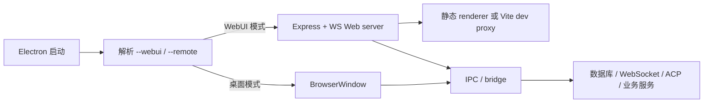
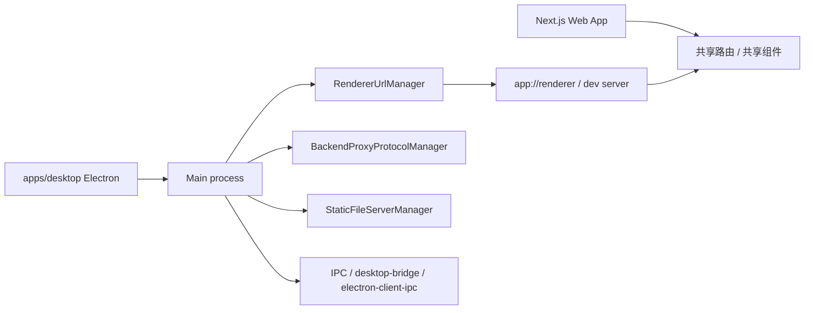

# Web + Desktop 双端架构分析

> 研究对象：`AionUi`、`LobeHub`，并补充 `Proma`、`ClawTeam`、`AgentAPI` 的边界说明。
>
> 核心结论：真正把 Web 端和桌面端都做成正式产品形态的，当前仓库里我能确认的是 `AionUi` 和 `LobeHub`。两者都不是简单的“桌面壳套网页”，而是分别形成了不同的双端架构范式。

## 1. 全景结论

| 项目 | 是否双端 | Web 端形态 | Desktop 端形态 | 架构关键词 |
|---|---|---|---|---|
| AionUi | 是 | Browser/WebUI | Electron 桌面应用 | 单仓库双运行时、WebUI server、IPC + WebSocket |
| LobeHub | 是 | Next.js Web 应用 | Electron 桌面壳 | Web-first、共享路由、协议代理、native bridge |
| Proma | 否 | 无独立 Web 端 | Electron 桌面应用 | 桌面-only、renderer 仅承担 UI |
| ClawTeam | 否 | Web UI / 控制台 | 无桌面端 | CLI + Web UI、文件化 swarm runtime |
| AgentAPI | 否 | HTTP API + Web Chat | 无桌面端 | API server、web chat、PTY 仿真 |

## 2. 双端架构的两种主流范式

### 2.1 单仓库双运行时

代表：AionUi。

同一套产品能力在两种运行模式下工作：

- 桌面模式：Electron + 主进程 + 渲染进程。
- WebUI 模式：同一主进程代码直接起 Web server，对外提供浏览器访问。

这种模式的重点是“运行时切换”，不是“产品分叉”。

### 2.2 Web-first + 桌面壳

代表：LobeHub。

Web 端是主产品，桌面端是一个额外的 Electron 壳，把 Web 端前端、路由和部分业务逻辑复用进来，再通过 IPC、协议和本地服务补齐桌面能力。

这种模式的重点是“共享前端资产 + 桌面能力注入”，不是重写一套桌面 UI。

## 3. AionUi

### 3.1 架构总览

AionUi 的入口在 `../../codes/AionUi/src/index.ts`，通过 `--webui`、`--remote` 等开关决定当前跑的是桌面模式还是 WebUI 模式。  
WebUI 模式会直接调用 `startWebServer()`，而不是创建窗口。

相关实现分布在：

- `../../codes/AionUi/src/index.ts`
- `../../codes/AionUi/src/process/webserver/index.ts`
- `../../codes/AionUi/src/process/bridge/webuiBridge.ts`
- `../../codes/AionUi/src/process/webserver/routes/staticRoutes.ts`

### 3.2 启动链路

桌面模式下，`src/index.ts` 会创建窗口；WebUI 模式下，它会启动 Express + WebSocket 服务，并保持进程存活。  
安装脚本也直接支持 headless 启动：`../../codes/AionUi/scripts/install-ubuntu.sh` 里使用 `xvfb-run ... AionUi --webui --remote --no-sandbox`。

### 3.3 WebUI 的实现方式

WebUI 不是“另一个独立前端仓库”，而是同一套 renderer 在浏览器里运行：

- `staticRoutes.ts` 在生产环境提供打包后的 renderer。
- 开发环境下直接代理到 Vite dev server。
- `webserver/index.ts` 负责 API、静态资源、WebSocket 和鉴权。
- `webuiBridge.ts` 提供启动、停止、状态查询、二维码登录等控制面。

这意味着 AionUi 的 Web 端本质上是“应用内 Web 服务”，而不是额外部署的一套 SaaS 前端。

### 3.4 关键桥接层

AionUi 最值得借鉴的是它把“桌面能力”和“Web 能力”都收口到统一的 bridge 体系里：

- `../../codes/AionUi/src/common/adapter/main.ts` 把主进程事件广播到窗口和 WebSocket 客户端。
- `../../codes/AionUi/src/common/adapter/registry.ts` 维护 WebSocket 广播器与 bridge emitter。
- `../../codes/AionUi/src/process/bridge/webuiBridge.ts` 负责 WebUI 的控制面。
- `../../codes/AionUi/src/renderer/services/FileService.ts` 在 WebUI 和 Electron 环境下走不同的上传路径。
- `../../codes/AionUi/src/renderer/services/i18n/index.ts` 说明了 WebUI 与 Electron 之间的状态同步问题。

### 3.5 这个架构的优点

- 一套核心逻辑，两个运行时入口。
- WebUI 适合远程访问、移动端访问和 headless 部署。
- 桌面端保留系统级能力和本地交互。
- UI 层对环境差异有明确分支，行为可控。

### 3.6 需要注意的点

- WebUI 模式会引入跨 origin、鉴权、WebSocket 心跳等额外复杂度。
- 桌面与浏览器的文件上传、缓存、localStorage、下载目录都不是同一套语义。
- 运行时切换比“单端应用”更复杂，调试时要关注模式开关和服务端口。

## 4. LobeHub

### 4.1 架构总览

LobeHub 的根目录是一个 Web-first monorepo，Web 端走 Next.js，桌面端则在 `apps/desktop` 下单独维护 Electron 壳。

相关入口：

- `../../codes/lobehub/package.json`
- `../../codes/lobehub/apps/desktop/package.json`
- `../../codes/lobehub/apps/desktop/src/main/core/App.ts`
- `../../codes/lobehub/apps/desktop/src/main/core/infrastructure/RendererUrlManager.ts`
- `../../codes/lobehub/apps/desktop/src/main/core/infrastructure/BackendProxyProtocolManager.ts`

### 4.2 启动与加载链路

桌面端的核心不是“重新做一套网页”，而是：

- 通过 `RendererUrlManager` 决定开发态加载 dev server，还是生产态走 `app://renderer`。
- 通过 `RendererProtocolManager` 提供生产环境的静态路由解析。
- 通过 `BackendProxyProtocolManager` 把后端请求代理到远端，并注入认证信息。
- 通过 `StaticFileServerManager` 暴露本地文件服务。

### 4.3 双端共享前端的方式

LobeHub 的 Web 和桌面并不是完全分叉的产品线，而是共享了大部分前端结构：

- `../../codes/lobehub/src/spa/entry.web.tsx`
- `../../codes/lobehub/src/spa/entry.desktop.tsx`
- `../../codes/lobehub/src/spa/router/desktopRouter.sync.test.tsx`
- `../../codes/lobehub/packages/const/src/version.ts`
- `../../codes/lobehub/src/routes/(main)/_layout/index.tsx`

这里的关键点是 `isDesktop`：

- 运行时通过 `isDesktop` 判断环境。
- UI 组件在桌面端注入 `TitleBar`、`AuthRequiredModal`、`DesktopNavigationBridge`、`Overlay*` 等能力。
- 同一套路由在 Web 与桌面之间通过同步测试保持一致。

### 4.4 桌面能力如何注入

桌面端真正的价值在于 native 能力，不在于渲染层本身：

- `Browser.ts` 负责创建窗口、加载 URL、处理外链、拦截请求和生命周期。
- `BackendProxyProtocolManager.ts` 负责把协议请求转成真实 HTTP 请求，并附加认证头。
- `StaticFileServerManager.ts` 负责本地文件预览、项目文件和桌面文件的可访问性。
- `electron-client-ipc` / `electron-server-ipc` 负责主进程与渲染进程之间的能力暴露。

桌面端因此获得了：

- 本地文件系统能力
- Shell / Git / 更新 / 托盘 / 截屏 / 原生窗口能力
- 更深的系统集成

### 4.5 这个架构的优点

- Web 端和桌面端共享业务前端，重复成本低。
- 桌面端只是能力增强，不是 UI 重写。
- 路由和组件可通过测试保持同步。
- Web 与桌面边界清晰，便于分别部署和演进。

### 4.6 需要注意的点

- 桌面端的协议层、代理层和本地文件层会让启动链路更长。
- `app://`、`localfile://`、后端代理协议都需要单独维护。
- `isDesktop` 分支过多时，要防止 Web/桌面行为逐步漂移。

## 5. 非双端项目的边界

### 5.1 Proma

Proma 是 Electron 桌面应用，`../../codes/Proma/package.json` 里只有 `apps/electron` 入口，没有独立 Web 应用。  
它的“Web 技术栈”只是桌面壳里的 renderer，不等于 Web 端产品。

### 5.2 ClawTeam

ClawTeam 是 CLI swarm runtime，外加 Web UI 展示和控制入口，但没有独立桌面端。  
它更接近“CLI + Web 控制台”，不是“双端产品”。

### 5.3 AgentAPI

AgentAPI 是 HTTP API + Web Chat 界面，核心形态是服务端和网页，不包含桌面壳。

## 6. 可借鉴的设计原则

1. 先抽运行时边界，再做 UI。
2. 桌面能力放到 bridge/protocol/proxy 层，不要散落在页面里。
3. Web 与桌面共享路由和组件时，要有同步测试兜底。
4. 运行时差异要显式化，用 `isDesktop`、`--webui` 这类开关控制，而不是靠隐式判断。
5. 本地文件、远端后端、窗口渲染应分层处理，避免“一个请求走到底”。
6. 对 WebUI 模式要单独考虑鉴权、跨域、WebSocket、存储源和上传语义。

## 7. 参考阅读

- [AionUi UI 渲染层](../../docs/ui-rendering/AionUi.md)
- [LobeHub UI 渲染层](../../docs/ui-rendering/lobehub.md)
- [Agent Team 实现总览](../../docs/agent-team/README.md)
- [AionUi WebUI 文档](../../codes/AionUi/docs/guides/webui.md)
- [LobeHub Desktop 文档](../../codes/lobehub/docs/self-hosting/advanced/desktop.mdx)
